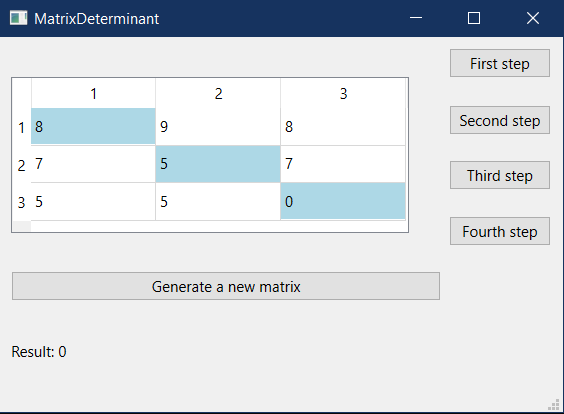
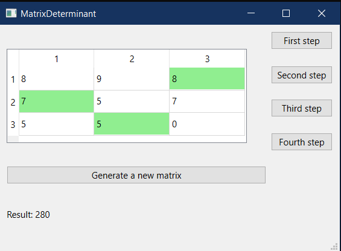
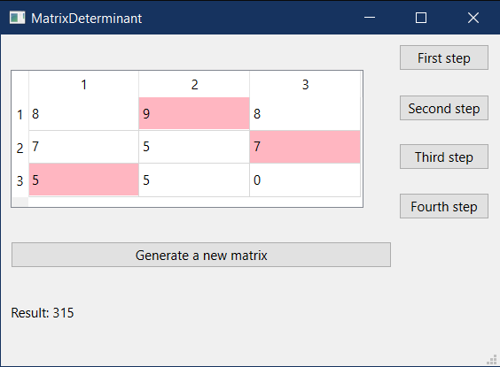
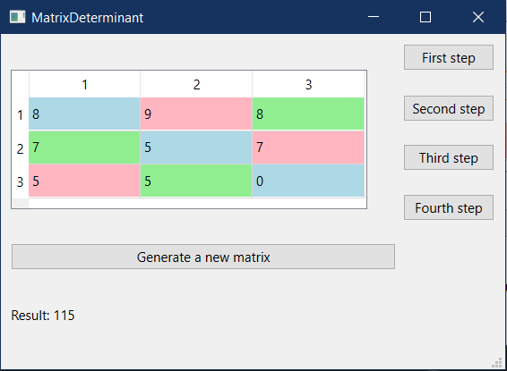
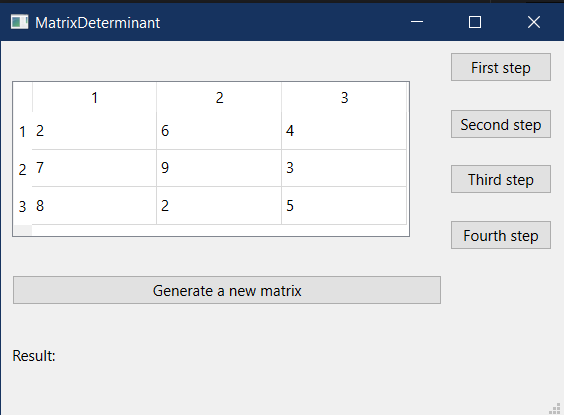

# Лабораторная работа №4 #

## Создание интерфейса простых приложений ##

## Вариант 5 ##

## Цель лабораторной работы ##

Отработка умений и навыков описания событий в приложениях.

## Задание ##

Напишите программу, анимирующую операцию нахождения определителя матрицы 3х3.

Создайте интерфейс программы: в таблице 3х3 числа получить случайным образом по
сигналу от предусмотренной кнопки; кнопки «Шаг 1», «Шаг 2», «Шаг 3» и «Шаг 4»
должны выполнять соответствующие действия по определению определителя матрицы,
при этом на каждом шаге в таблице цветом должны быть подсвечены элементы, с
которыми производятся действия; результат должен быть выведен в поле надписи.

## Ход работы ##

Файлы проекта:

- [main.cpp](./src/main.cpp)
- [matrixdeterminant.h](./src/matrixdeterminant.h)
- [matrixdeterminant.cpp](./src/matrixdeterminant.cpp)
- [matrixdeterminant.ui](./src/matrixdeterminant.ui)

## Демонстрация работы приложения ##

Первый шаг нахождения определителя:

Второй шаг нахождения определителя:

Третий шаг нахождения определителя:

Четвертый шаг нахождения определителя:

Есть возможность сгенерировать новую матрицу:

## Вывод ##

Отработали умения и навыки описания событий в приложениях.
