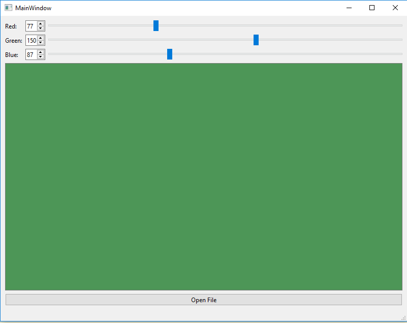
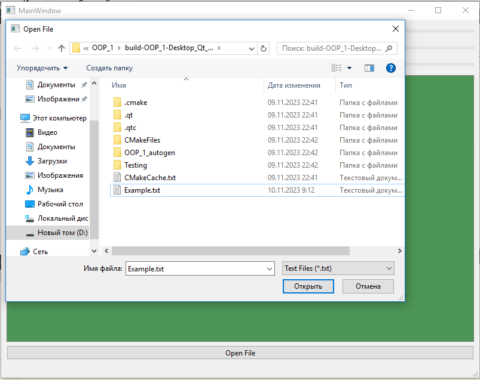
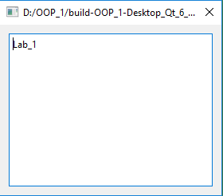

# Отчет по лабораторной работе №1

## Использование библиотеки элементов графического интерфейса Qt


`Сорока Вадим Сергеевич (ПО-8)`

## Цель лабораторной работы

Научиться использовaть библиотеку элементов графического интерфейса Qt.

## Задание *(4 балла)*

* Выполняем задание, согласно лабораторной работе, создаем макет нашего приложения

* Используем классы QSpinBox, QSlider, QPlainTextEdit, QGridLayout


## Знакомство с элементами интерфейса: добавим функциональность. *(3 балла)*

* Добавим функциональноcть созданному на прeдыдущем этапе приложению:

  * спин-боксы и слайдeры будут перемещаться синхронизировано в диапазоне значений от 0 до 255.

  * Цвет фона QPlainTextEdit будет меняться соответственно

* Выполнение:

  * Выставляем диапазон допустимых значений для QSpinBox и QSlider при помощи метода setRange(0, 255)

  * Реализуем метод setColor() и слоты setRed(int value), setGreen(int value), setBlue(int value)

  * к слотам подключаем сигналы valueChanged()

    * в реализации слотов синхронизируем значения слайдера и спин-бокса и вызываем setColor()

* Для изменения цвета фона текстового поля реализуем следующий код.

```c++
void MainWindow::setColor()
{
    // Получаем значения компонентов RGB
    int red = redSpinBox->value();
    int green = greenSpinBox->value();
    int blue = blueSpinBox->value();

    // Обновляем стиль текстового поля с цветом
    QString style = QString("QPlainTextEdit { background: #%1%2%3; }")
                        .arg(red, 2, 16, QChar('0'))
                        .arg(green, 2, 16, QChar('0'))
                        .arg(blue, 2, 16, QChar('0'));

    textEdit->setStyleSheet(style);
}
```



## Диалоги *(3 балла)*

Библиотека графических элементoв Qt предлагает набор из нескольких полнофункциональных диалоговых окон. Среди них такие, как выбор файла в файловой системе, выбор шрифта, выбор цвета, диалог печати и некоторые другие. Мы рассмотрим в настоящей работе пример использования диалога выбора файла - QFileDialog.

**Создаём простейший обозреватель текстовых файлов.**

* Создаём элемент с помощью

```c++
textEdit = new QPlainTextEdit("", this);
```

* Добавляем элемент на форму

```c++
layout->addWidget(textEdit, 3, 0, 1, 3);
```

* Добавляем кнопку "Open File"

```c++
QPushButton *openButton = new QPushButton("Open File", this);
layout->addWidget(openButton, 4, 0, 1, 3);
```

* Подключаем сигнал от кнопки к слоту открытия файла

```c++
connect(openButton, SIGNAL(clicked()), this, SLOT(openFile()));
```

* Создаем новое диалоговое окно для вывода текста файла

```c++
QDialog *fileDialog = new QDialog(this);
QVBoxLayout *dialogLayout = new QVBoxLayout(fileDialog);

QPlainTextEdit *fileViewer = new QPlainTextEdit(fileContent, fileDialog);
dialogLayout->addWidget(fileViewer);

fileDialog->setWindowTitle(filePath);
fileDialog->exec();
```




