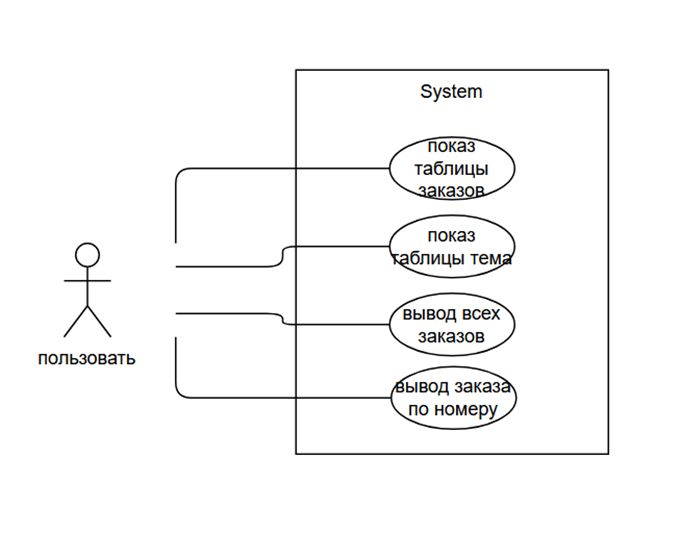

# Лабораторная работа №6 #

## Изучение UML. Диаграмма прецедентов (Use Case)
## Вариант 2 ##

## Цель лабораторной работы ##

Освоить построение диаграммы прецедентов.

## Вывод ##

Освоили построение диаграммы прецедентов.