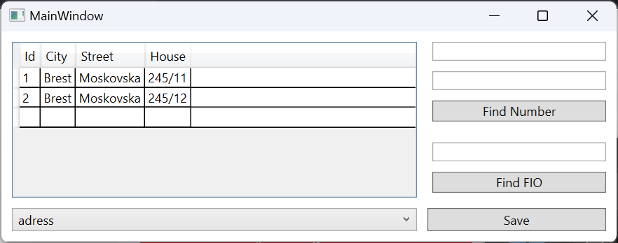
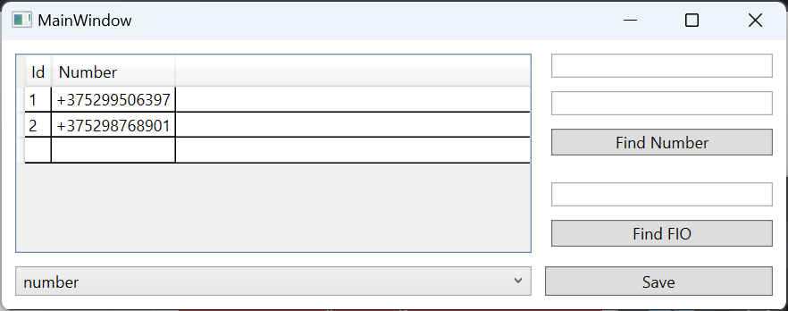
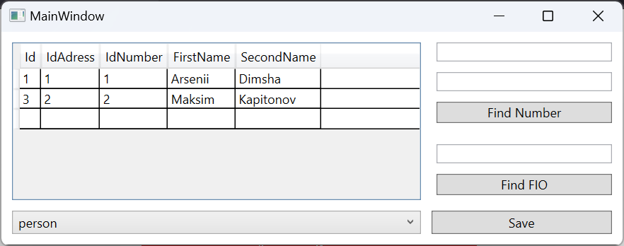
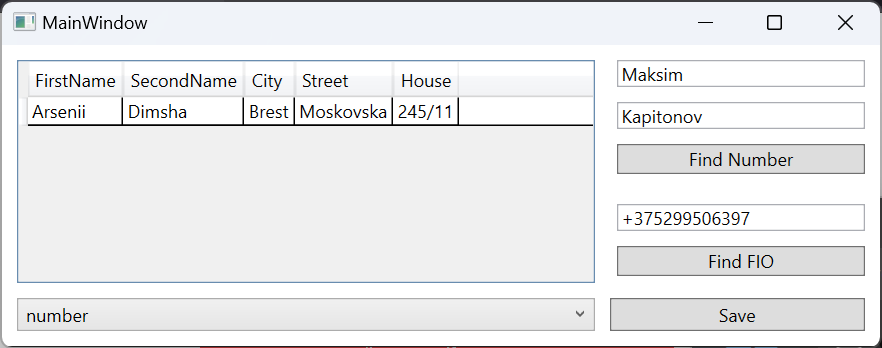
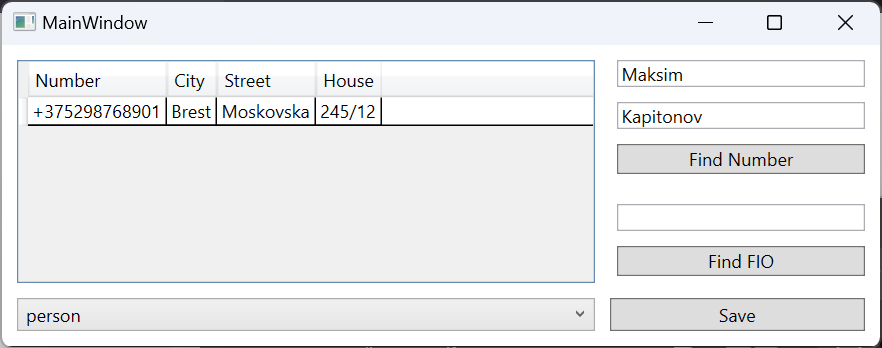
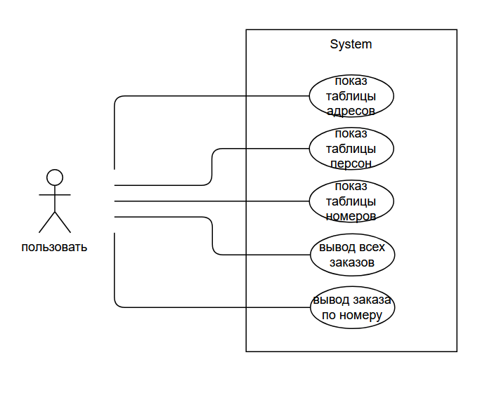

# Лабораторная работа №5 #

## Создание интерфейса простых приложений ##

## Вариант 2 ##

## Цель лабораторной работы ##

Отработка умений и навыков создания интерфейса баз данных.

## Реализация ##

Файлы проекта:

- [MainWindow.xaml](./WpfApp1/MainWindow.xaml)
- [MainWindow.xaml.cs](./WpfApp1/MainWindow.xaml.cs)

## Результат работы программы ##

Вывод таблицы adress:

Вывод таблицы number:

Вывод таблицы person:

Вывод ФИО по номеру:

Вывод номера по ФИО:

## Вывод ##

Отработали умения и навыки создания интерфейса баз данных.

# Лабораторная работа №6 #

## Изучение UML. Диаграмма прецедентов (Use Case)
## Вариант 2 ##

## Цель лабораторной работы ##

Освоить построение диаграммы прецедентов.

## Вывод ##

Освоили построение диаграммы прецедентов.