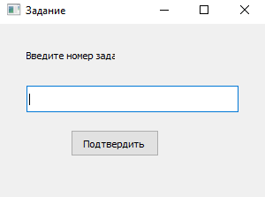
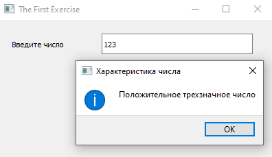
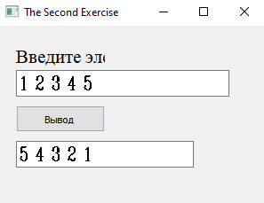
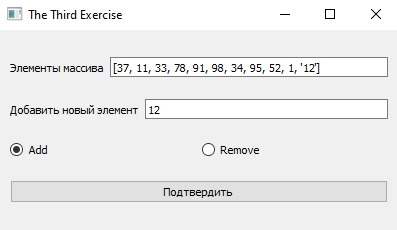
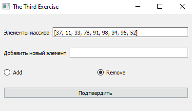
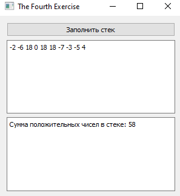
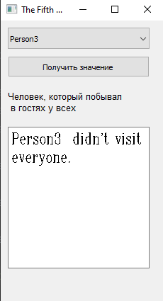
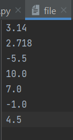
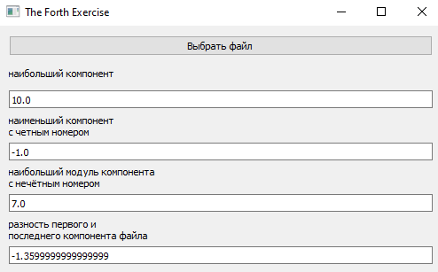

# Отчет по лабораторной работе №3

## Контейнеры в Qt5

## Реализация/ход работы

Запуск программы приводит к данному окну, в котором вводим номер задания
Окно приложения:

Число, лежащее в диапазоне от -999 до 999, вводится в lineedit. Вывести информационное сообщение − словесное описание данного числа вида «отрицательное двузначное число», «нулевое число», «положительное однозначное число» и т.д.
Окно приложения:

Дан массив размера N. Вывести его элементы в обратном порядке.
Окно приложения:

Заполнить список случайными элементами. Реализовать добавление элемента в конец списка и удаления с конца (использовать RadioButton для выбора действия).
Окно приложения:

Заполнить стек 10 случайными числами из интервала [-10; 20]. Просмотреть содержимое стека. Найти сумму положительных чисел, хранящихся в стеке.

Имеется список класса (все имена различны). Определить, есть ли в классе человек, который побывал в гостях у всех. (Для каждого ученика составить множество побывавших у него в гостях друзей, сам ученик в это множество не входит.)

Дан файл f, компоненты которого являются действительными числами. Найдите:
а) наибольший компонент;
б) наименьший компонент с четным номером;
в) наибольший модуль компонента с нечётным номером;
г) разность первого и последнего компонента файла.

