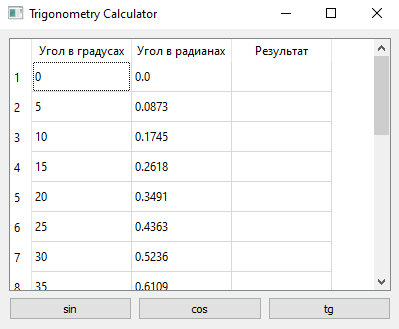
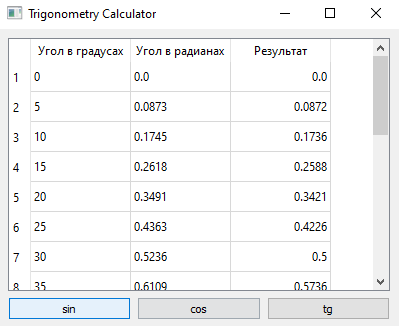
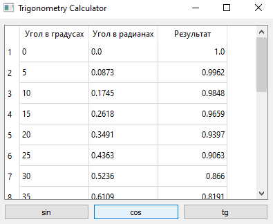

# Отчет по лабораторной работе №4

## Создание интерфейса простых приложений

## Вариант 1

## Реализация/ход работы

При запуске программы видим следующее.

sin
Окно приложения:

cos
Окно приложения:

tg
Окно приложения:

