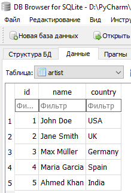
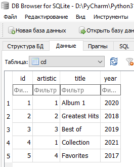
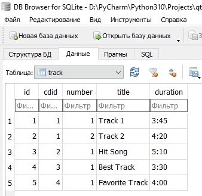
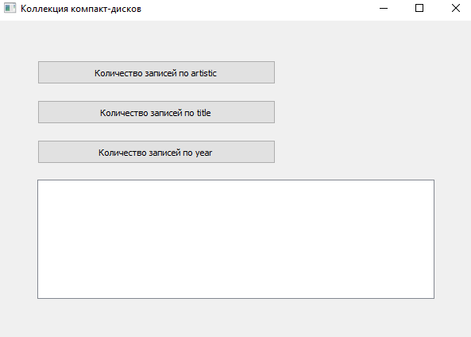
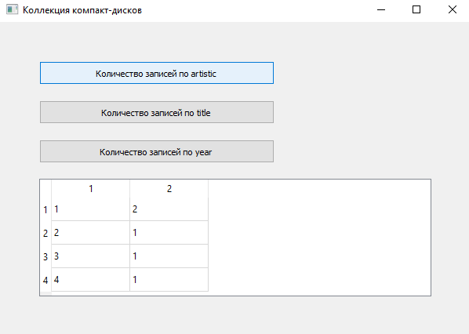
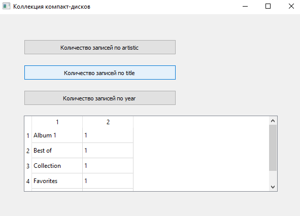
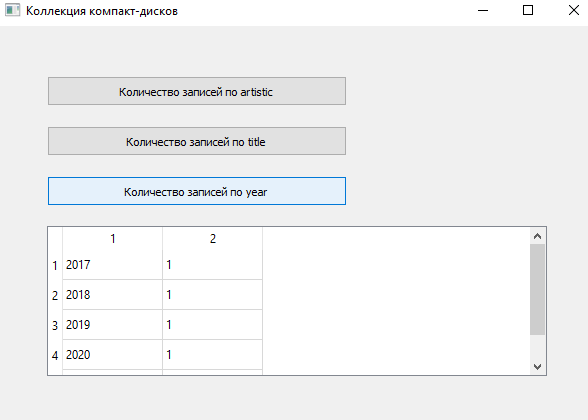

# Отчет по лабораторной работе №5

## Создание приложений баз данных

## Вариант 1

Напишите программу «Коллекция компакт-дисков». В программе использовать три таблицы: artist (поля id, name, country), cd (поля id, artistic, title, year) и track (поля id, cdid, number, title, duration). Создать запросы: определение количества записей по полям cd.artistic, cd.title, cd.year.

Созданные талицы в базе данных

Запуск программы приводит к данному окну, в котором находиться поле и три кнопки('количество записаей по artistics, количество записаей по title, количество записаей по year')

Запрос на количнства записей по полью "artistics"

Запрос на количнства записей по полью "title"

Запрос на количнства записей по полью "year"

