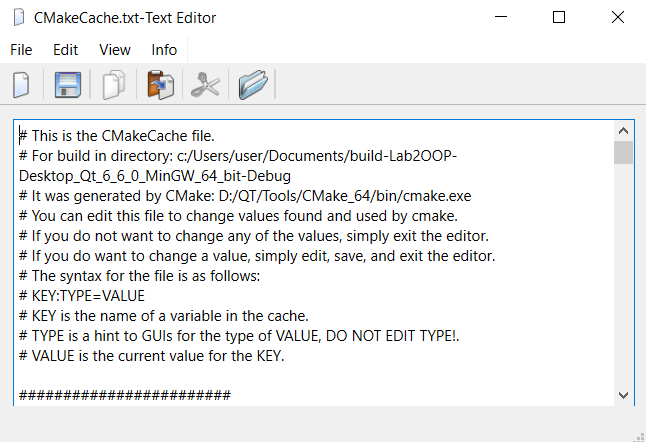

# Лабораторная работа №2

## Основы Qt

## Вариант 2

`Бердникова Вероника Анатольевна`
`ПО-9`

## Цель лабораторной работы

Понимание структуры приложения на Qt и получение опыта использования стандартной документации Qt.

## Ход работы

При запуске программы открывается окно

Изменение шрифта текста:

Открытие файла:

Создание новых файлов:

При закрытии без сохранения выпадает предупреждение:

Сохранение файла:

