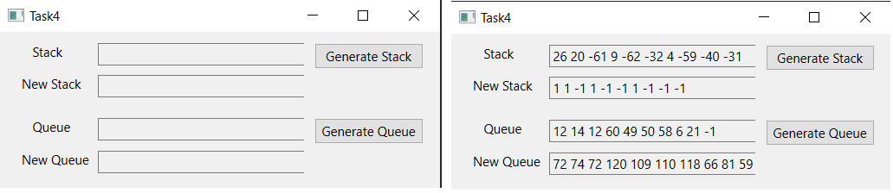

# Лабораторная работа №3 #

## Контейнеры в Qt5 ##

## Вариант 2 ##

### Ход работы ###

### Задание 1 ###

Значения переменных X, Y, Z (переменные вводятся в lineedit) поменять местами так, чтобы они оказались упорядоченными по убыванию

### Задание 2 ###

Дан массив размера N. Вывести вначале его элементы с четными индексами, а затем с нечетными.
Дана матрица размера m*n. Найти суммы элементов всех ее четных и нечетных столбцов (нахождение суммы четных / нечетных столбцов определяется пользователем в виджете comboBox).

### Задание 3 ###

Заполнить список случайными элементами. Реализовать добавление элемента в конец списка и удаление с начала (использовать RadioButton для выбора действия).
Создать два списка. Реализовать замену одного списка на другой.

### Задание 4 ###

Сформировать стек из 10 случайных целых чисел. Заменить в стеке все положительные значения на 1, а отрицательные – на -1.
Сформировать очередь из 10 чисел. Увеличить все значения в очереди на ее максимальный элемент. Результат поместить в очередь.

### Задание 5 ###

Задан некоторый набор товаров. Определить для каждого товара, какие из них имеются в каждом из n магазинов, какие товары есть хотя бы в одном магазине, каких товаров нет ни в одном магазине.

### Задание 6 ###

Дан файл f, компоненты которого являются целыми числами. Запишите в файл g наибольшее значение первых пяти компонентов файла f, затем – следующих пяти компонентов и т.д. Если в последней группе окажется менее пяти компонентов, то последний компонент файла g должен быть равен наибольшему из компонентов файла f, образующих последнюю (неполную) группу.

