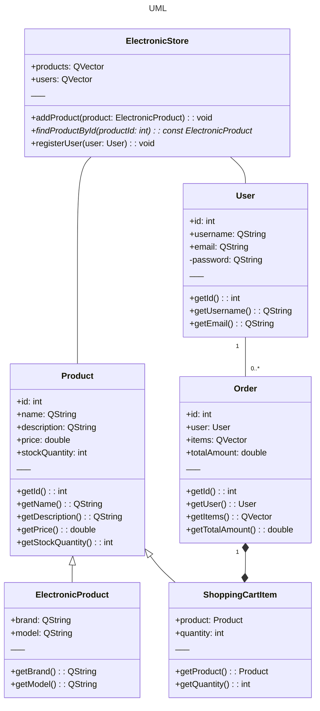

# Лабораторная работа № 6 #

## UML - диаграммы ##

## Вариант 2 ##

Постройте UML диаграмму классов для онлайн-магазина, который продает электронику.

```mermaid
---
title: UML
---
classDiagram
    class Product { 
        +id: int
        +name: QString
        +description: QString
        +price: double
        +stockQuantity: int
        ___
        +getId(): int
        +getName(): QString
        +getDescription(): QString
        +getPrice(): double
        +getStockQuantity(): int
    }

    class ElectronicProduct { 
        +brand: QString
        +model: QString
        ___
        +getBrand(): QString
        +getModel(): QString
    }

    class ShoppingCartItem {
        +product: Product
        +quantity: int
        ___
        +getProduct(): Product
        +getQuantity(): int
    }

    class User { 
        +id: int
        +username: QString
        +email: QString
        -password: QString
        ___
        +getId(): int
        +getUsername(): QString
        +getEmail(): QString
    }

    class Order {
        +id: int
        +user: User
        +items: QVector<ShoppingCartItem>
        +totalAmount: double
        ___
        +getId(): int
        +getUser(): User
        +getItems(): QVector<ShoppingCartItem>
        +getTotalAmount(): double
    }

    class ElectronicStore {
        +products: QVector<ElectronicProduct>
        +users: QVector<User>
        ___
        +addProduct(product: ElectronicProduct): void
        +findProductById(productId: int): const ElectronicProduct*
        +registerUser(user: User): void
    }

    Product <|-- ElectronicProduct
    Product <|-- ShoppingCartItem
    User "1" -- "0..*" Order
    ElectronicStore -- Product
    ElectronicStore -- User
    Order "1" *--* ShoppingCartItem

```
