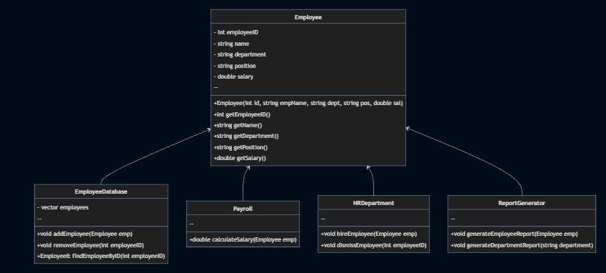

# Лабораторная работа №6
## Изучение UML. Диаграмма классов.
## Цель лабораторной работы 
Освоить построение диаграммы классов.

## Вариант 4
4. Постройте UML диаграмму классов для системы управления персоналом.

## Демонстрация работы 

