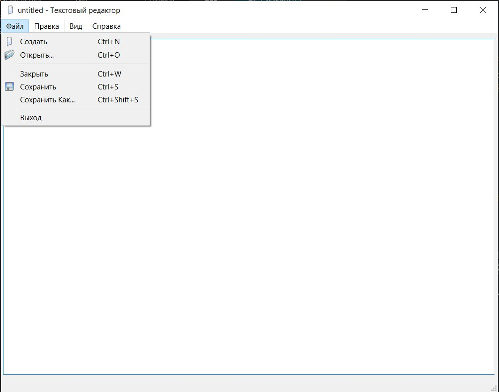
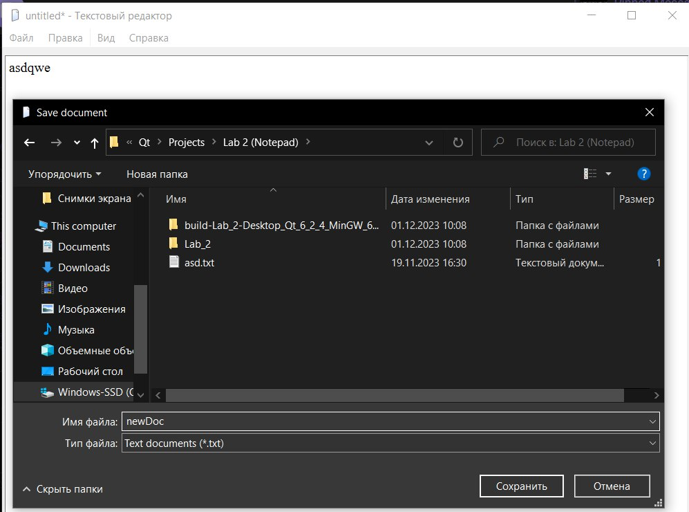
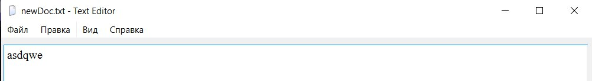
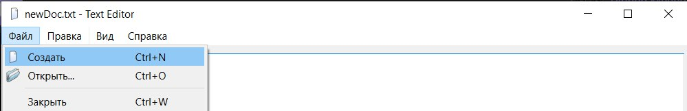
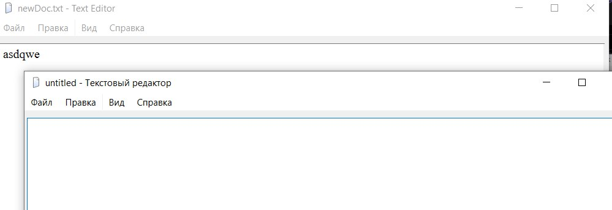

# Лабораторная работа №2

## Основы Qt

## Вариант 6

`Зейденс Никита Вячеславович ПО-9`

## Цель лабораторной работы

Понимание структуры приложения на Qt и получение опыта использования стандартной документации Qt.

## Ход работы

Файлы проекта:

- [main.cpp](./src/main.cpp)
- [texteditor.h](./src/texteditor.h)
- [texteditor.cpp](./src/texteditor.cpp)

Файл ресурсов:

- [textEditor.qrc](./src/textEditor.qrc)

## Демонстрация работы приложения

Основное окно текстового редактора с меню файла:

Сохранение файла после изменения:

Окно текстового редактора после сохранения:

Создание нового окна:

## Вывод

Было создано приложение Qt, реализующее базовый функционал текстового редактора windows.
