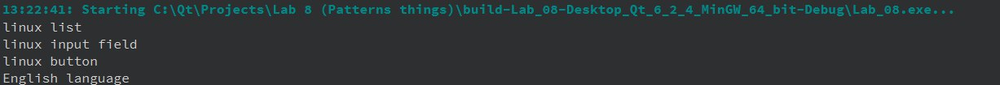

# Отчет по лабораторной работе №8

## Паттерны проектирования

## Цель лабораторной работы

Отработка умений и навыков применения паттернов проектирования.

## Вариант №2

1\. Применить паттерн абстрактная фабрика при построении интерфейса пользователя Продукты фабрики: список, поле ввода, кнопка, язык отображения.

2\. Применить паттерн проектирования “Prototype” совместно с абстрактной фабрикой, то есть внести изменения в проект “Порождающие паттерны. Абстрактная фабрика”. То есть теперь в проекте абстрактная фабрика должна параметризоваться прототипами.

3\. Применить паттерн проектирования “Singleton” совместно с абстрактной фабрикой, то есть внести изменения в проект, разработанный на лабораторной работе “Порождающие паттерны. Абстрактная фабрика”.

4\. Применить паттерн “Строитель” для построения:

- Отчета по частям

  - Части: Header – Заголовок, Block – Блок содержащий данные по отчету (результат SQL запроса), Ending – Концевик

  - ConcreteBuilder: HtmlBuilder, TxtBuilder, XlsBuilder, DocBuilder

- Представления робота в игровой программе

  - Части: Head, Body, Engine

  - ConcreteBuilder выбрать самостоятельно

- Представления лица героя в ролевой игровой программе
  - Части: Eyes  - параметры (Color, Figure), Nose (Color , Figure), Mouth (Color, Figure), Ears (Color, Figure), Hair (Color, Figure)

  - ConcreteBuilder: UglyFaceBuilder, GoodFaceBuilder, SmileFaceBuilder

5\. Применить паттерн “Фабричный метод” при создании конкретного строителя и передачи его клиенту. Самостоятельно продумать контекст в каркасе для вызова шаблонного метода.

## Код программы

- [Builder.h](./src/Builder.h)

- [AbstractFactory.h](./src/AbstractFactory.h)

- [main.cpp](./src/main.cpp)

## Результат работы

## Вывод

Умения и навыки работы с паттернами проектирования были получены
