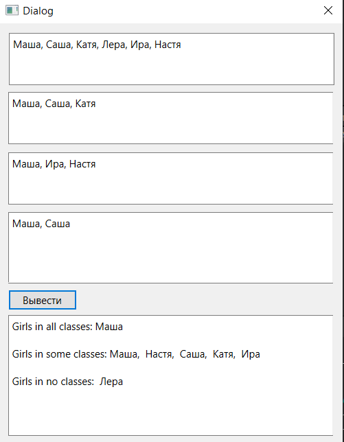

# Отчет по лабораторной работе №3

## Контейнеры в Qt5

## Реализация/ход работы

В классе MainWindow реализовано меню. Оно встречает нас при открытии приложения:

При нажатии на кнопку открывается окно с соответствующим заданием.

### Задания

#### Задание 1 (Вариант 8)

    Даны три переменные: X, Y, Z (переменные вводятся в lineedit). Если их значения упорядочены по убыванию, то удвоить их; в противном случае заменить значение каждой переменной на противоположное.

#### Задание 2 (Вариант 3)

    Дан целочисленный массив A. Вывести номер первого из тех его элементов A[i], которые удовлетворяют двойному неравенству: A[1] < A[i] < A[10]. Если таких элементов нет, то вывести 0.

    Дана матрица размера m x n. Найти минимальное и максимальное значение в каждой строке (нахождение максимального/минимального значения определяется пользователем в виджете comboBox).

#### Задание 3 (Вариант 3)

    Заполнить 2 списка случайными элементами. Реализовать добавление введенного элемента в 1 список или второй, или в оба (использовать CheckBox).

    Заполнить связный список случайными элементами и отсортировать их по возрастанию.

#### Задание 4 (Вариант 3)

    Заполнить стек 10 случайными числами из интервала [-10; 80]. Заменить все значения остатками от деления на номер элемента в стеке.

    Сформировать очередь из 8 чисел. Заменить значение первого элемента очереди суммой первого и последнего, значение второго элемента очереди − суммой второго и предпоследнего и т.д.

#### Задание 5 (Вариант 3)

    Заданы имена девочек. Определить, какие из этих имен встречаются во всех классах данной параллели, какие есть только в некоторых классах, какие из этих имен не встречаются ни в одном классе.

#### Задание 6 (Вариант 3)

    Даны символьные файлы f1 и f2. Перепишите с сохранением порядка следования компоненты файла f1 в файл f2, а компоненты файла f2 – в файл f1. Используйте вспомогательный файл h.

Файлы генерируются программно.

