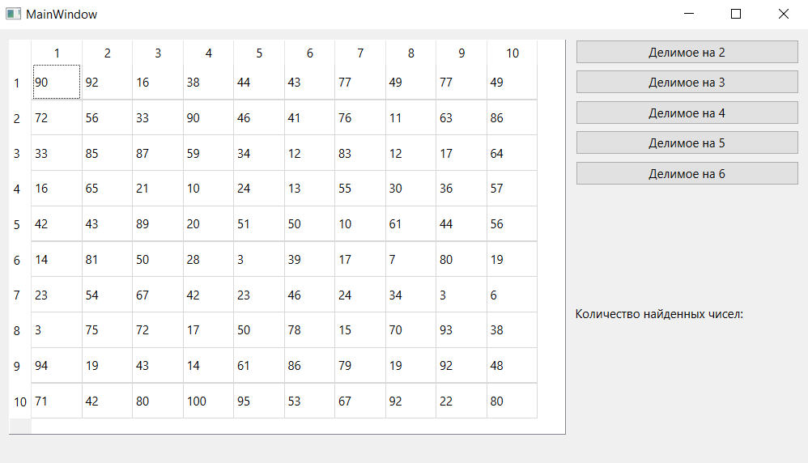
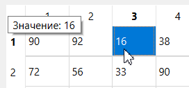
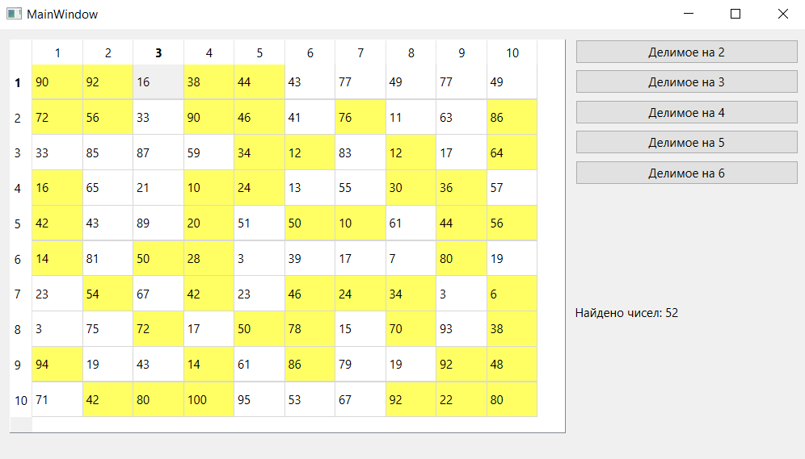
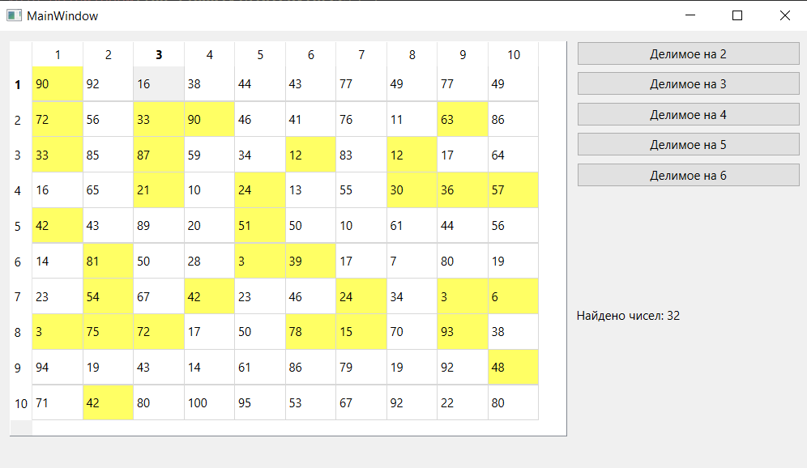
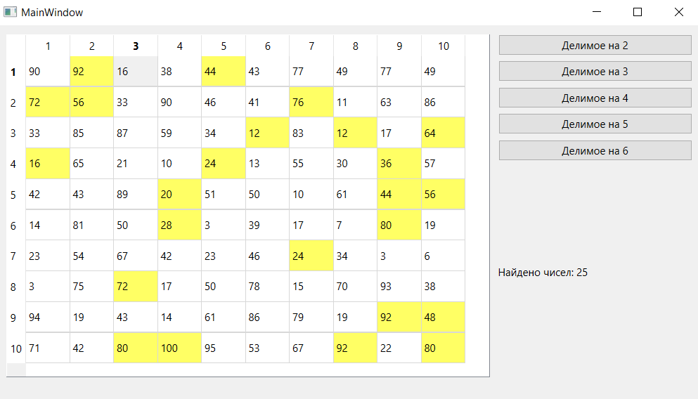
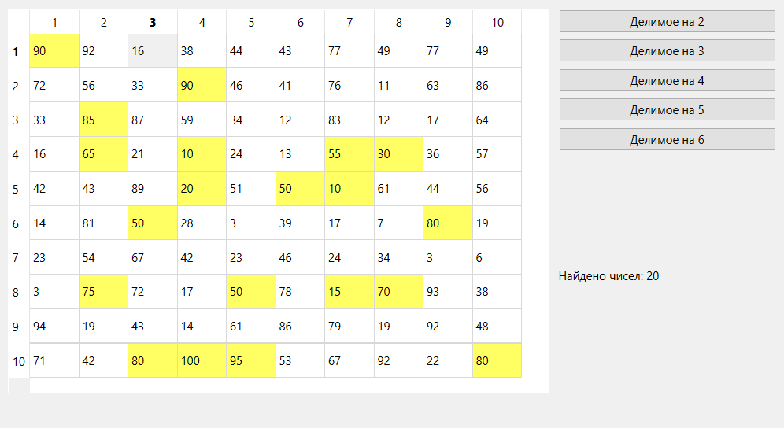
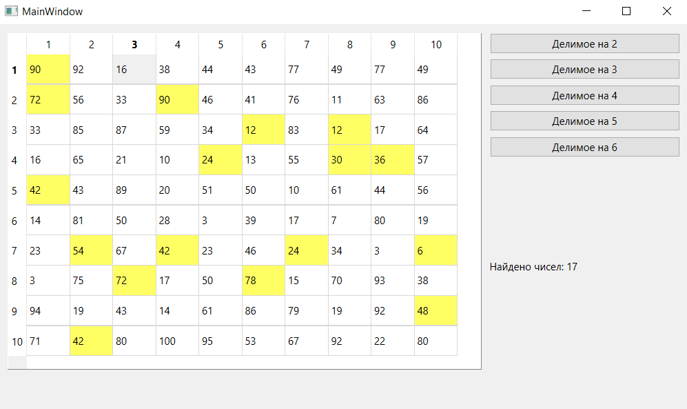

# Отчет по лабораторной работе №4

## Создание интерфейса простых приложений

## Вариант 8

Напишите программу, которая находит в массиве 10х10 числа делимые на 2, 3, 4, 5 и 6. Создайте интерфейс программы: в таблице 10х10 числа получить случайным образом; создать кнопки выполняемых действий; результат действий подсвечивать цветом; в поле надписи выводить количество найденных чисел.

## Реализация/ход работы

При запуске программы видим следующее.

При щелчке на элемент:

Подсвечивание чисел, делимых на определенное число:

На 2:

На 3:

На 4:

На 5:

На 6:

