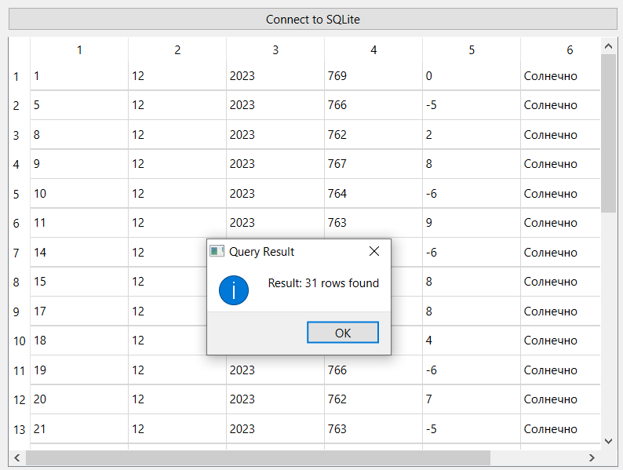
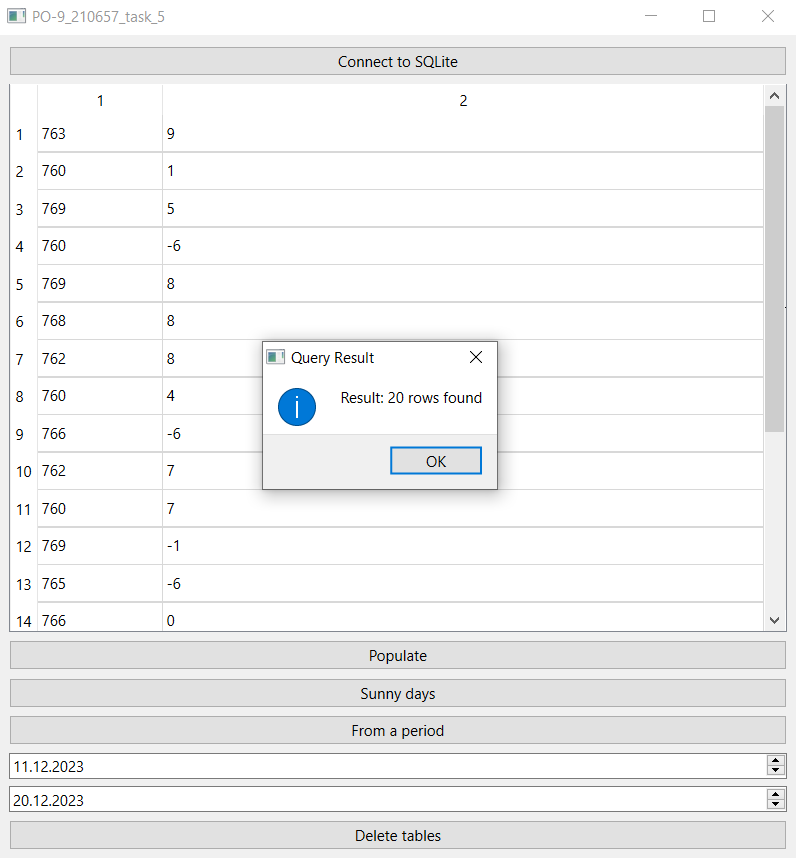

# Отчет по лабораторной работе №5

## Создание приложений баз данных

## Вариант 8

Напишите программу «Учет погоды». В программе использовать две таблицы: day (поля id, day, month, year) и pogoda (поля id, davlenie, temperat, vid). Создать запросы: определить количество солнечных дней за месяц; вывести температуру и давление за заданный период.

## Реализация/ход работы

При открытии приложения сперва нужно подключиться к базе данных с помощью кнопки "Connect to SQLite". Заполнить таблицу можно c помощью кнопки "Populate". При необходимости можно удалить таблицы с помощью кнопки "Delete tables".

С помощью кнопки "Sunny days" можно ввести месяц, за который необходимо определить количество солнечных дней, и затем результат будет выведен в таблицу на экране.

С помощью кнопки "From a period" можно ввести температуру и давление за все дни периода, начало и конец которого можно ввести в поля ниже кнопки.

