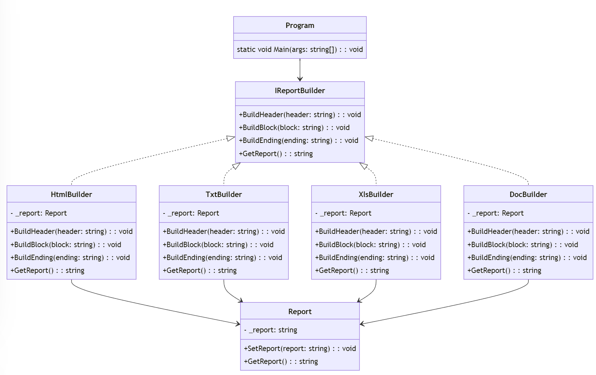
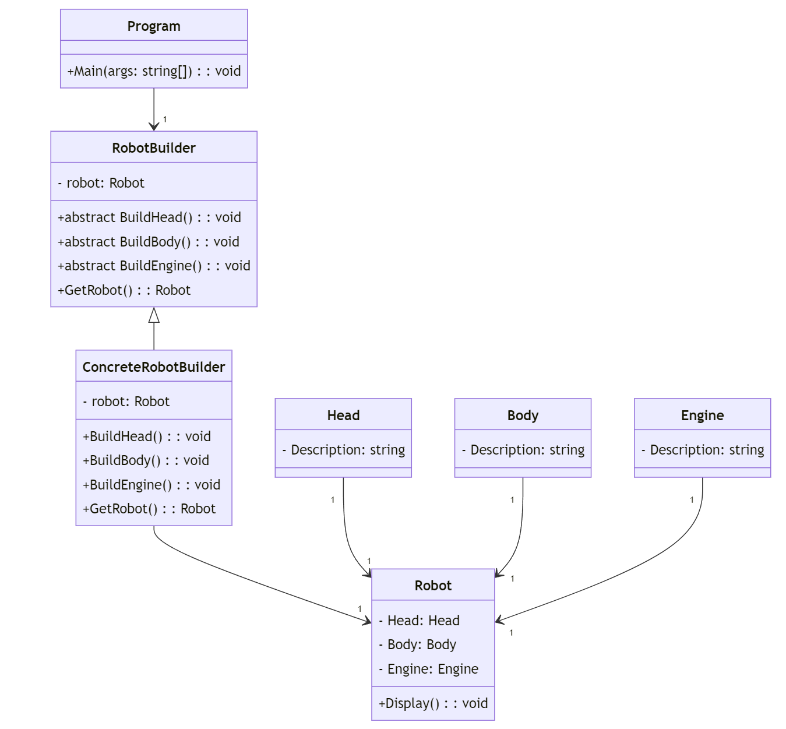
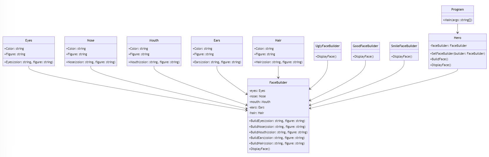

# Отчет по лабораторной работе №6

## Изучение UML. Диаграмма классов.

## Вариант №9

`Кухарев Дмитрий Николаевич (ПО-9)`

## Цель работы

Освоить построение диаграммы классов.

## Задание 

Постройте UML диаграмму классов для системы управления учебным процессом в школе.

## Результат выполнения

#### Создадим UML-диаграммы для лабораторной работы №8:

## Вывод

Освоили построение диаграммы классов.

