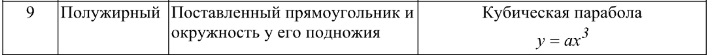

# Отчет по лабораторной работе №7

## Графические примитивы в библиотеке QT.

## Вариант №9

`Кухарев Дмитрий Николаевич (ПО-9)`

## Цель работы

Изучить графические примитивы при создании приложений с GUI.

## Задание 
1. Вывести заданным шрифтом вертикально на экран наименование лабораторной работы.
2. Нарисовать цветную фигуру (2 балла) и организовать движение её по заданной
траектории (6 баллов).

## Результат выполнения

## Код программы

Код меню программы находится в [Form1.cs](./src/Form1.cs).

Остальные файлы созданы с помощью WinForms

## Вывод

Изучили графические примитивы при создании приложений с GUI.
