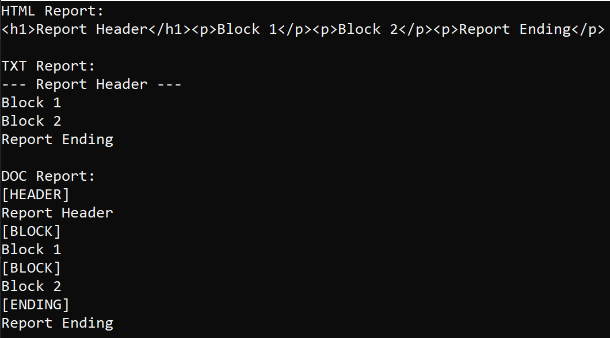

# Отчет по лабораторной работе №5

## Создание приложений баз данных.

## Вариант №9

`Кухарев Дмитрий Николаевич (ПО-9)`

## Цель работы

Изучить паттерны проектирования.

## Задание 
С помощью программы SQLiteManager создать необходимые таблицы в файле базы данных. Наполнение таблиц осуществлять из созданной программы.

Напишите программу «Учет работы компьютеров в сети». В программе использовать
две таблицы: hosts (поля id, name, host) и users (поля id, user, hour). Создать запросы: 
* определить время работы компьютера в сети; 
* вывести список пользователей заданного компьютера; 
* указать пользователя работавшего за компьютером в указанное время.
Для возможности выполнения всех запросов создадим дополнительную таблицу users_time.
## Результат выполнения

## Код программы

Код программы находится в [Form1.cs](./src/Form1.cs).

Остальные файлы созданы с помощью WinForms

## Вывод

Изучили паттерны проектирования.

