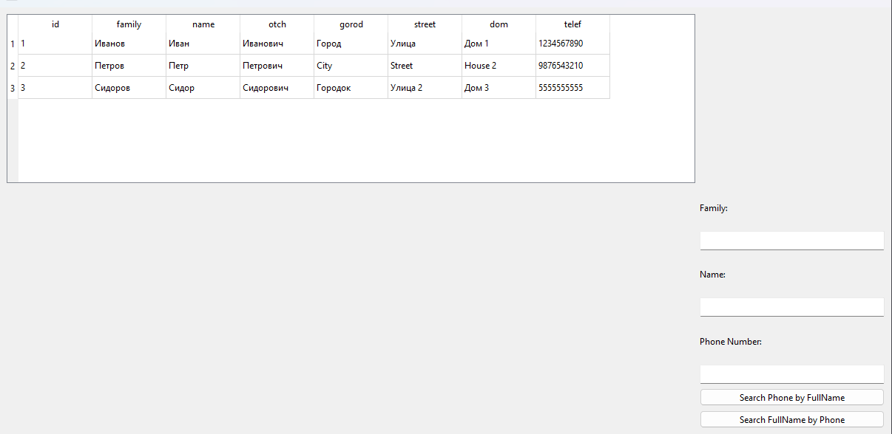
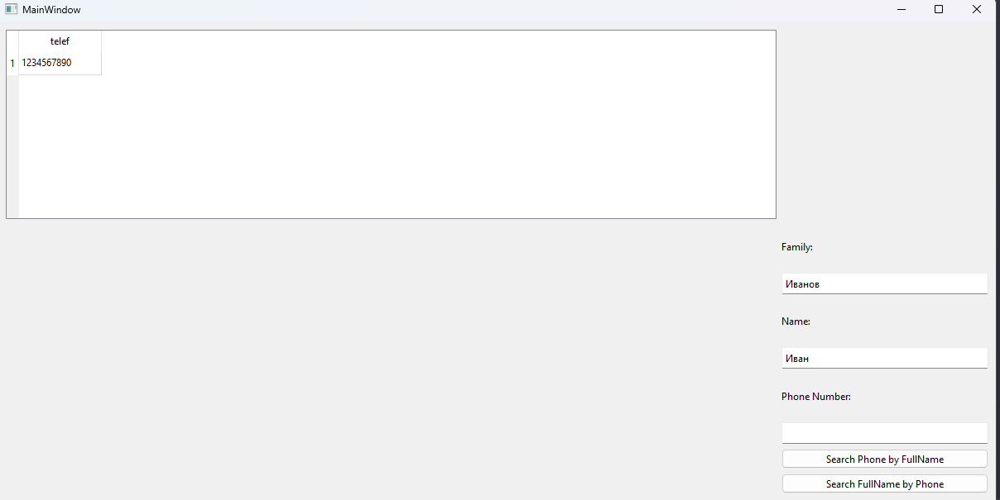
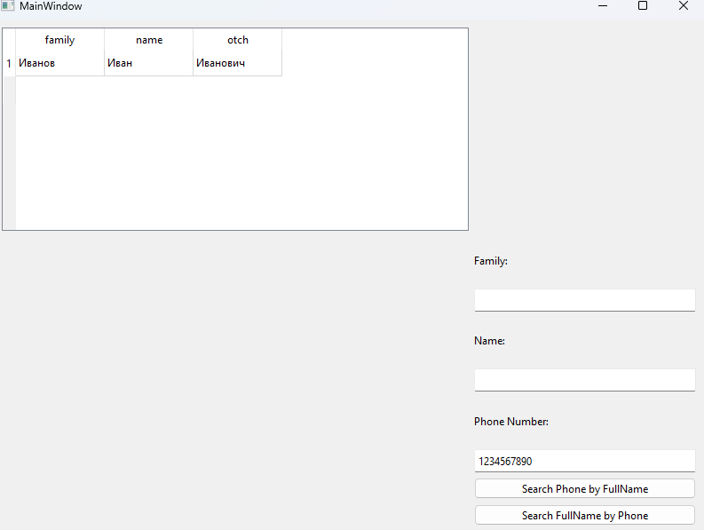

# Лабораторная работа №5

## Создание приложений баз данных

## Вариант 14

## Цель лабораторной работы

Отработка умений и навыков создания интерфейса баз данных.

## Задание №2

Напишите программу «Адресная книга». В программе использовать три таблицы: fio (поля id, family, name, otch), address (поля id, gorod, street, dom) и telephone (поля id, telef). Создать запросы: поиск телефона по фамилии и имени; поиск Ф.И.О. по номеру телефона.

## Демонстрация работы приложения

## Вывод

Отработал умения и навыки создания интерфейса баз данных
