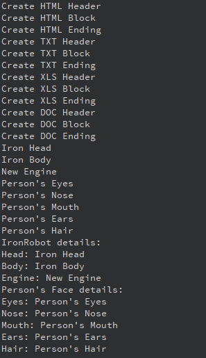

# Лабораторная работа № 8 #
# Паттерны проектирования #
# Цель работы #
Изучить паттерны проектирования в С++.
# Вариант 14 #
4. Применить паттерн “Строитель” для построения

    - 1.Отчета по частям
      - Части: Header – Заголовок, Block – Блок содержащий данные по отчету (результат SQL запроса), Ending – Концевик
      - ConcreteBuilder: HtmlBuilder, TxtBuilder, XlsBuilder, DocBuilder
    - 2.Представления робота в игровой программе
      - Части: Head, Body, Engine
      - ConcreteBuilder выбрать самостоятельно
    - 3.Представления лица героя в ролевой игровой программе
      - Части: Eyes  - параметры (Color, Figure), Nose (Color , Figure), Mouth (Color, Figure), Ears (Color, Figure), Hair (Color, Figure)
      - ConcreteBuilder: UglyFaceBuilder, GoodFaceBuilder, SmileFaceBuilder
# Демонстрация работы приложения #

