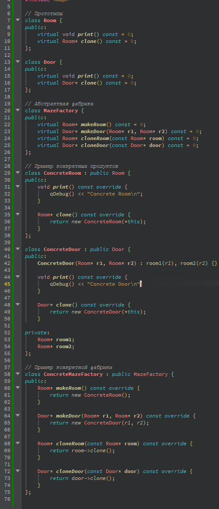
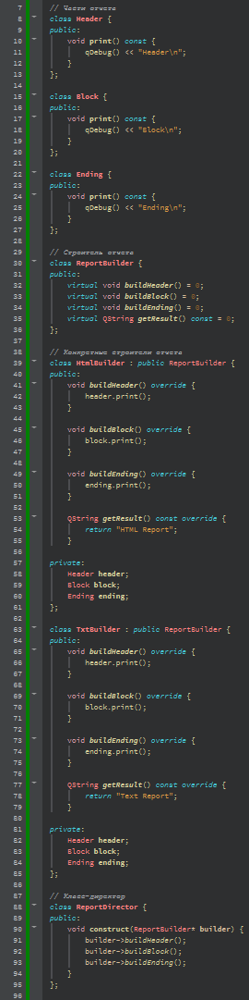
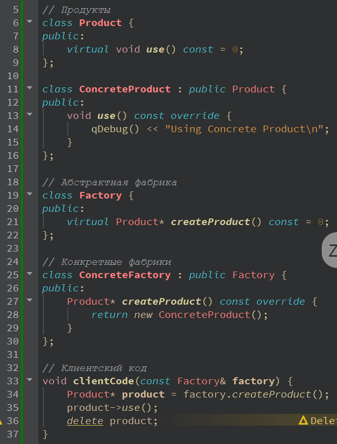

# Отчет по лабораторной работе №8

## Паттерны проектирования

## Вариант №15

> \[!NOTE]
> Был выбран **вариант №3**. Так как всего 3 варианта, находим
> `15 % 3 = 0`

Вариант ~~ы~~ :

3\. Применить паттерн абстрактная фабрика при построении логической структуры лабиринта. Продукты фабрики: комната, дверь.

Применить паттерн проектирования “Prototype” совместно с абстрактной фабрикой. То есть теперь в проекте абстрактная фабрика должна параметризоваться прототипами.

Применить паттерн проектирования  “Singleton” совместно с абстрактной фабрикой.

Применить паттерн “Строитель” для построения:

- Отчета по частям

  - Части: Header – Заголовок, Block – Блок содержащий данные по отчету (результат SQL запроса), Ending – Концевик

  - ConcreteBuilder: HtmlBuilder, TxtBuilder, XlsBuilder, DocBuilder

- Представления робота в игровой программе

  - Части: Head, Body, Engine

  - ConcreteBuilder выбрать самостоятельно

- Представления лица героя в ролевой игровой программе
  - Части: Eyes  - параметры (Color, Figure), Nose (Color , Figure), Mouth (Color, Figure), Ears (Color, Figure), Hair (Color, Figure)

  - ConcreteBuilder: UglyFaceBuilder, GoodFaceBuilder, SmileFaceBuilder

Применить паттерн  “Фабричный метод” при создании конкретного строителя и передачи его клиенту.  Самостоятельно продумать контекст в каркасе для вызова шаблонного метода.

## Код программы

- [AbstructFactoryWithPrototypes.cpp](./src/AbstructFactory.cpp)

  

- [Builder.cpp](./src/Builder.cpp)

  

- [FactoryMethodWithAbstructFactory.cpp](./src/FactoryMethodWithAbstructFactory.cpp)

  
