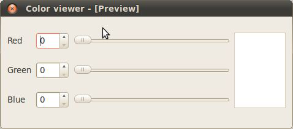
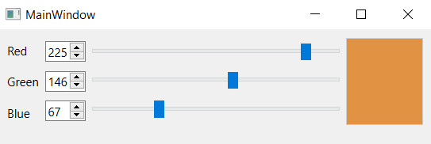
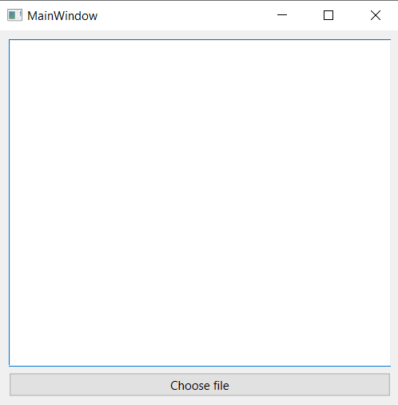
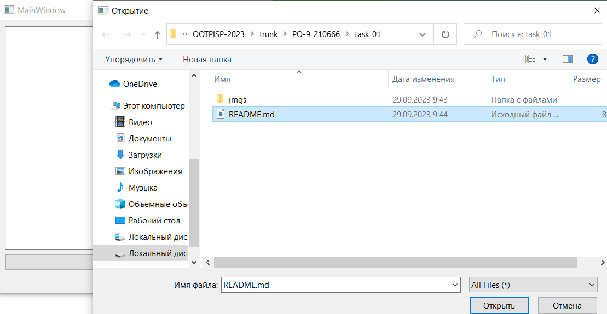
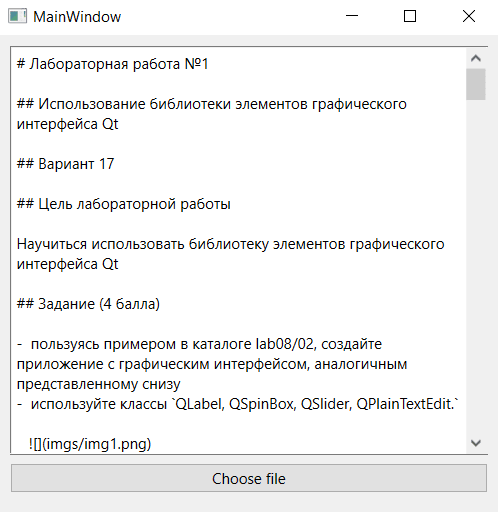

# Лабораторная работа №1

## Использование библиотеки элементов графического интерфейса Qt

## Вариант 17

## Цель лабораторной работы

Научиться использовать библиотеку элементов графического интерфейса Qt

## Задание (4 балла)

-  пользуясь примером в каталоге lab08/02, создайте приложение с графическим интерфейсом, аналогичным представленному снизу
-  используйте классы `QLabel, QSpinBox, QSlider, QPlainTextEdit.`

   

## Знакомство с элементами интерфейса: добавим функциональность (3 балла)

-  Добавим функциональность созданному на предыдущем этапе приложению:

   -  спин-боксы и слайдеры будут перемещаться синхронизировано в диапазоне значений от 0 до 255.
   -  Цвет фона QPlainTextEdit будет меняться соответственно

-  Выполнение:

   -  Выставляем диапазон допустимых значений для QSpinBox и QSlider при помощи методов setMinimum() и setMaximum()
   -  запрещаем ввод в текстовое поле: setEnabled(false)
   -  Реализуем метод setColor() и слоты setRed(int), setGreen(int), setBlue(int)
   -  к слотам подключаем сигналы QSlider::sliderMoved() и QSpinBox::valueChanged()
   -  в реализации слотов синхронизируем значения слайдера и спин-бокса и вызываем setColor()

-  Для изменения цвета фона текстового поля воспользуемся таблицами стилей для описания стиля элементов.
   -  таблицы стилей используют синтаксис CSS
   -  будем задавать цвет в виде строки типа #rrggbb
   -  таким образом, надо задать QPlainTextEdit следующий стиль:
   -  QPlainTextEdit { background: #rrggbb; }
   -  задаём стиль при помощи метода setStyleSheet() (таблица стиля передаётся в виде строки).

## Создаём простейший обозреватель текстовых файлов (3 балла)

-  Создайте новый виджет и поместите на него элемент QTextEdit.
-  Добавьте кнопку QPushButton и подключите её сигнал clicked() к слоту openFile()
-  Реализуйте в слоте выбор имени файла пользователем: QFileDialog::getOpenFileName()
-  Откройте QFile в соответствии с выбранным названием
-  Прочитайте его содержимое и поместите в виде текста в элемент QTextEdit

## Код программы

### Приложение выбора цвета

mainwindow.h

```c++
#ifndef MAINWINDOW_H
#define MAINWINDOW_H

#include <QMainWindow>
#include "QPushButton"
#include "QRadioButton"
#include "QSpinBox"
#include "QLabel"
#include "QSlider"
#include "QPlainTextEdit"
#include "QFormLayout"

QT_BEGIN_NAMESPACE
namespace Ui { class MainWindow; }
QT_END_NAMESPACE

class MainWindow : public QMainWindow
{
    Q_OBJECT

public:
    MainWindow(QWidget *parent = nullptr);
    ~MainWindow();

    void setColor();

    int r{0};
    int g{0};
    int b{0};

    QPlainTextEdit* txtEdit;
    QSpinBox* sb1;
    QSpinBox* sb2;
    QSpinBox* sb3;
    QSlider* sl1;
    QSlider* sl2;
    QSlider* sl3;

private:
    Ui::MainWindow *ui;

public slots:
    void setRed(int r);
    void setGreen(int g);
    void setBlue(int b);
};
#endif // MAINWINDOW_H
```

mainwindow.cpp (constructor)

```c++
#include "mainwindow.h"
#include "ui_mainwindow.h"

MainWindow::MainWindow(QWidget *parent)
    : QMainWindow(parent)
    , ui(new Ui::MainWindow)
{
    ui->setupUi(this);

    QGridLayout* grid_layout = new QGridLayout;
    this->centralWidget()->setLayout(grid_layout);

    QVBoxLayout* v_box_layout1 = new QVBoxLayout;
    QVBoxLayout* v_box_layout2 = new QVBoxLayout;
    QVBoxLayout* v_box_layout3 = new QVBoxLayout;
    QVBoxLayout* v_box_layout4 = new QVBoxLayout;
    grid_layout->addLayout(v_box_layout1, 0, 0);
    grid_layout->addLayout(v_box_layout2, 0, 1);
    grid_layout->addLayout(v_box_layout3, 0, 2);
    grid_layout->addLayout(v_box_layout4, 0, 3);

    QLabel* sb_label1 = new QLabel;
    QLabel* sb_label2 = new QLabel;
    QLabel* sb_label3 = new QLabel;
    sb_label1->setText("Red");
    sb_label2->setText("Green");
    sb_label3->setText("Blue");
    v_box_layout1->addWidget(sb_label1, Qt::AlignCenter);
    v_box_layout1->addWidget(sb_label2, Qt::AlignCenter);
    v_box_layout1->addWidget(sb_label3, Qt::AlignCenter);

    sb1 = new QSpinBox;
    sb2 = new QSpinBox;
    sb3 = new QSpinBox;
    sb1->setMaximum(255);
    sb2->setMaximum(255);
    sb3->setMaximum(255);
    v_box_layout2->addWidget(sb1, Qt::AlignCenter);
    v_box_layout2->addWidget(sb2, Qt::AlignCenter);
    v_box_layout2->addWidget(sb3, Qt::AlignCenter);

    sl1 = new QSlider(Qt::Orientation::Horizontal);
    sl2 = new QSlider(Qt::Orientation::Horizontal);
    sl3 = new QSlider(Qt::Orientation::Horizontal);
    sl1->setMinimumWidth(250);
    sl2->setMinimumWidth(250);
    sl3->setMinimumWidth(250);
    sl1->setMaximum(255);
    sl2->setMaximum(255);
    sl3->setMaximum(255);
    v_box_layout3->addWidget(sl1, Qt::AlignCenter);
    v_box_layout3->addWidget(sl2, Qt::AlignCenter);
    v_box_layout3->addWidget(sl3, Qt::AlignCenter);

    txtEdit = new QPlainTextEdit;
    txtEdit->setEnabled(false);
    txtEdit->setStyleSheet("background: #000000;");
    v_box_layout4->addWidget(txtEdit);

    this->resize(450, 200);

    connect(sl1, &QSlider::valueChanged, this, &MainWindow::setRed);
    connect(sl2, &QSlider::valueChanged, this, &MainWindow::setGreen);
    connect(sl3, &QSlider::valueChanged, this, &MainWindow::setBlue);

    connect(sb1, &QSpinBox::valueChanged, this, &MainWindow::setRed);
    connect(sb2, &QSpinBox::valueChanged, this, &MainWindow::setGreen);
    connect(sb3, &QSpinBox::valueChanged, this, &MainWindow::setBlue);
}
```

Демонстрация работы приложения



### Обозреватель текстовых файлов

openfile.h

```c++
#ifndef OPENFILE_H
#define OPENFILE_H

#include <QMainWindow>
#include "QPushButton"
#include "QPlainTextEdit"
#include "QFormLayout"
#include "QFileDialog"
#include "QFile"
#include "QByteArray"

namespace Ui {
class OpenFile;
}

class OpenFile : public QMainWindow
{
    Q_OBJECT

public:
    explicit OpenFile(QWidget *parent = nullptr);
    ~OpenFile();

private:
    Ui::OpenFile *ui;
    QPlainTextEdit* txtEdit;

public slots:
    void openFile();
};

#endif // OPENFILE_H
```

openfile.cpp

```c++
#include "openfile.h"
#include "ui_openfile.h"

OpenFile::OpenFile(QWidget *parent) :
    QMainWindow(parent),
    ui(new Ui::OpenFile)
{
    ui->setupUi(this);

    QWidget* widget = new QWidget();
    this->setCentralWidget(widget);

    QVBoxLayout* v_box_layout = new QVBoxLayout;
    widget->setLayout(v_box_layout);

    txtEdit = new QPlainTextEdit;
    txtEdit->setReadOnly(true);
    QPushButton* bt = new QPushButton;
    bt->setText("Choose file");
    v_box_layout->addWidget(txtEdit);
    v_box_layout->addWidget(bt);

    this->resize(400, 400);

    connect(bt, &QPushButton::clicked, this, &OpenFile::openFile);
}

OpenFile::~OpenFile()
{
    delete ui;
}

void OpenFile::openFile(){
    QString fileName = QFileDialog::getOpenFileName(this);
    QFile file(fileName);
    if (!file.open(QIODevice::ReadOnly))
        qDebug() << "Error";
    QByteArray data;
    data = file.readAll();
    txtEdit->setPlainText(QString(data));
}
```

Демонстрация работы приложения







## Вывод

Я научился использовать библиотеку элементов графического интерфейса Qt и создал 2 приложения, используя её
