# Лабораторная работа №3

## Контейнеры в Qt5

## Вариант 19

Зеленков Константин Игоревич

## Цель лабораторной работы

Научиться использовать контейнеры в Qt

## Задания

Основное окно программы:

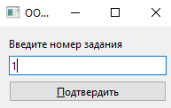

### Задание 1, Вариант 9

Формулировка

- Перераспределить значения переменных X и Y (переменные вводятся в lineedit ) так, чтобы в X оказалось меньшее из этих значений, а в Y − большее.

Демонстрация работы приложения

Введем 2 разнах числа, одно из них больше другого:

Нажимаем на кнопку перераспределить, вывод:

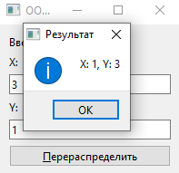

### Задание 2, Вариант 4

Формулировка

- Дана матрица размера m x n. В каждой строке найти количество элементов, больших среднего арифметического всех элементов этой строки.

Демонстрация работы приложения

Вывод количества элементов в каждой строке:

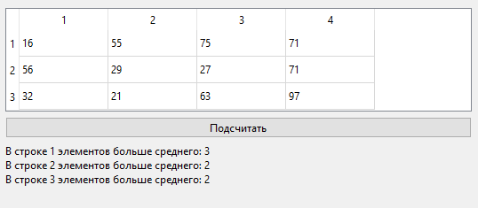

Значения в матрице получены случайно, но пользователь может самостоятельно поменять значения кликнув на значение, а далее написав свое значение.

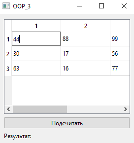

### Задание 3, Вариант 4

Формулировка

1. Заполнить список случайными элементами и реализовать удаление элементов с позиций с N по K.

2. Заполнить связный список случайными элементами и отсортировать их по убыванию.

Демонстрация работы приложения

Основное окно, лист автоматически генерируется изначально:

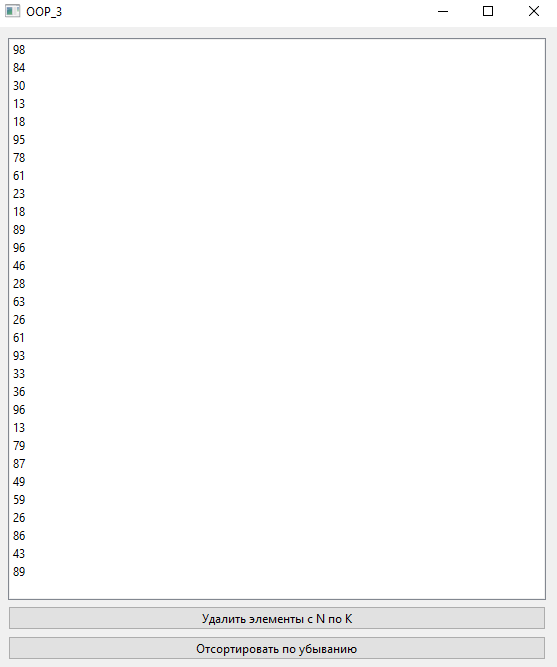

Удаление элементов с позиций с N по K

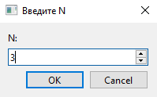

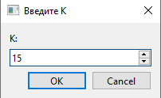

Сортировка по убыванию производится кликом по кнопке:

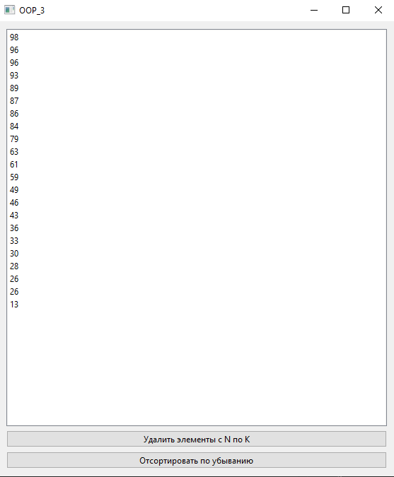

### Задание 4, Вариант 4

Формулировка

1. Сформировать стек из 8 чисел. Заменить значение первого элемента стека произведением первого и последнего, значение второго элемента стека − произведением второго и предпоследнего и т.д.

2. Заполнить очередь 8 случайными числами из интервала [-20; 50]. Найти среднее арифметическое значений двух соседних элементов очереди. Результат поместить в очередь.

Демонстрация работы приложения

Генерация стека из 8 чисел:

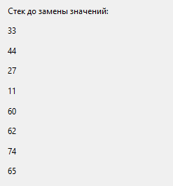

Замена значений первого элемента стека произведением первого и последнего, значения второго элемента стека − произведением второго и предпоследнего и т.д.:

Очередь заполнена 8 случайными числами из интервала [-20; 50].

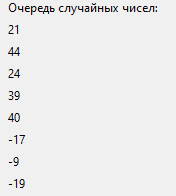

Среднее арифметическое значений двух соседних элементов очереди. Результат поместили в очередь.

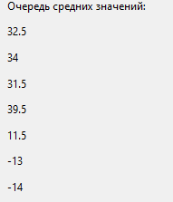

### Задание 5, Вариант 4

Формулировка

- Известны марки машин, изготовляемых в данной стране и импортируемых за рубеж. Даны некоторые N стран. Определить для каждой из марок, какие из них были доставлены во все страны, доставлены в некоторые из стран, не доставлены ни в одну страну.

Демонстрация работы приложения

Марки машин и импортируемые страны:

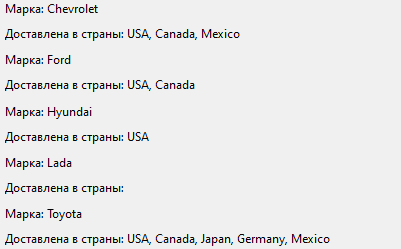

Определить для каждой из марок, какие из них были доставлены во все страны, доставлены в некоторые из стран, не доставлены ни в одну страну.

### Задание 6, Вариант 4

Формулировка

Дан файл f, компоненты которого являются целыми числами. Получите в файле g все компоненты файла f:

- являющиеся чётными числами;

- делящиеся на 3 и не делящиеся на 7;

- являющиеся точными квадратами.

Демонстрация работы приложения

Основное окно приложения:

Окно выбора файла:

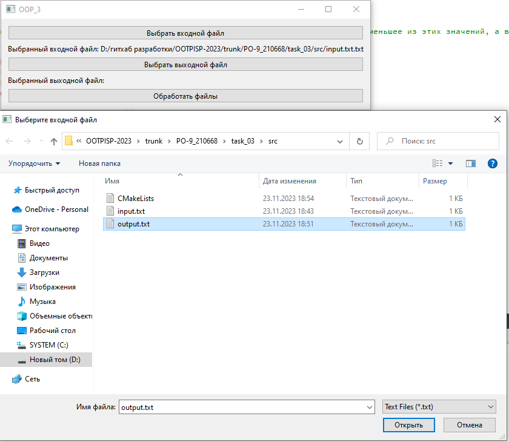

При выборе файла в основном окне показывает его путь

При выборе двух файлов можно нажать кнопку Обработать файлы и нам выведется:

Итоговые файлы:

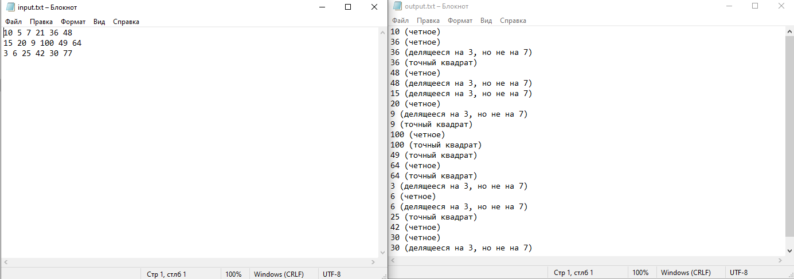

## Вывод

Научились использовать на практике контейнеры в Qt.
