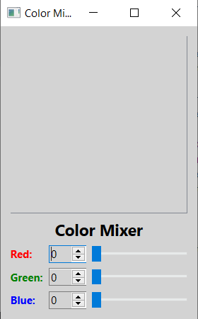
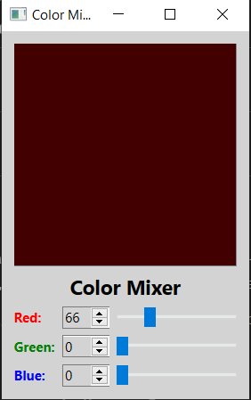
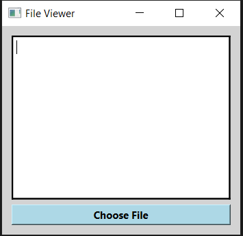
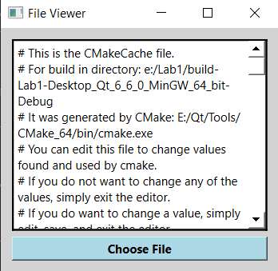

# Лабораторная работа №1

## Использование библиотеки элементов графического интерфейса Qt

## Вариант 20

## Ход работы

### Задание (4 балла)

- пользуясь примером в каталоге `lab08/02`, создайте приложение с графическим интерфейсом, аналогичным представленному сверху

- используйте классы `QLabel`, `QSpinBox`, `QSlider`, `QPlainTextEdit`.

### Знакомство с элементами интерфейса: добавим функциональность. (3 балла)

#### Добавим функциональность созданному на предыдущем этапе приложению

- спин-боксы и слайдеры будут перемещаться синхронизировано в диапазоне значений `от 0 до 255`.

- цвет фона `QPlainTextEdit` будет меняться соответственно

#### Выполнение

- Выставляем диапазон допустимых значений для `QSpinBox` и `QSlider` при помощи методов `setMinimum()` и `setMaximum()`

- запрещаем ввод в текстовое поле: `setEnabled(false)`

- Реализуем метод `setColor()` и слоты `setRed(int)`, `setGreen(int)`, `setBlue(int)`

- к слотам подключаем сигналы `QSlider::sliderMoved()` и `QSpinBox::valueChanged()`

- в реализации слотов синхронизируем значения слайдера и спин-бокса и вызываем `setColor()`

#### Для изменения цвета фона текстового поля воспользуемся таблицами стилей для описания стиля элементов

- таблицы стилей используют синтаксис `CSS`

- будем задавать цвет в виде строки типа `#rrggbb`

- таким образом, надо задать `QPlainTextEdit` следующий стиль:

  - `QPlainTextEdit { background: #rrggbb; }`

- задаём стиль при помощи метода `setStyleSheet()` (таблица стиля передаётся в виде строки).

### Диалоги (3 балла)

Библиотека графических элементов Qt предлагает набор из нескольких полнофункциональных диалоговых окон, позволяющих выполнять некоторые стандартные операции. Среди них такие, как выбор файла в файловой системе, выбор шрифта, выбор цвета, диалог печати и некоторые другие. Мы рассмотрим в настоящей работе пример использования диалога выбора файла - `QFileDialog`.
Проснулся Лололошка довольно рано, поэтому пару часов пролежал, тупо смотря в потолок и продумывая план дальнейших действий. Первым делом надо отправится во Фьету, чтобы попробовать найти Ашру, а затем в Льюмьнье, за Франом. А потом... Потом они вместе придумают, что делать дальше.

– Надейся и дальше. Ты же сам понимаешь, что не может быть всё так просто.
– У тебя есть идеи получше?

      Ответа не последовало.

      Без пяти девять контрабандист стоял у входа в «Пузатый Лис», нервно оглядываясь по сторонам. Это место было абсолютно не похоже на квартал воров, но в тоже время, попав сюда, у него не было сомнений, что это Биджо. Может, это из-за одежды воров, которая мало изменилась, а может из-за той самой атмосферы. Всё-таки, в большинстве городов не возникало настолько острого желания закрыть карманы, пристально следя за всем ценным.

      — Привет!

      К нему быстрым шагом приближался Киррь. Рюкзак за плечами говорил о том, что он, в отличие от шатена, подготовился к их «приключению».

      — Привет,— он обратился к приятелю.

      — Куда пойдём?— глаза блондина сверкали в предвкушении.— Марталь? Соэль?

      — Точно не второе,— усмехнулся парень.

      — Почему?

      — Чтобы туда пройти, нужен пропуск.

      — Не знал,— голубоглазый нахмурился.— А ты там уже был?

      — Да. Ладно, ближе к делу,— они неторопливо двинулись к выходу из города.— Предлагаю отправиться сначала в Фьету, может быть найдём Ашру.

      — Давай,— покладисто ответил блондин.

      Оба, естественно, в городе контрабандистов не были, поэтому шли наугад, используя компас и надеясь на удачу.

      Минут через десять они разговорились. Болтали парни о Междумирье, а точнее, о нападении Эбардо.

      —... Последнее, что помню – пытался достать соседа из-под обломков,— голос вора чуть дрогнул. Зрелище было не из приятных, и вспоминать его не сильно хотелось.— Потом, всё словно в тумане, потемнело... В следующее мгновение я был уже, ну типа в моём здешнем доме.

      — А я бежал в Храм Времени, только открыл дверь – и всё, словно ластиком стёрли часть воспоминаний. Проснулся уже здесь.

      — Странно всё это.

      — Ага.

      Дальше они шли молча, каждый погрузившись в свои угрюмые мысли. Время от времени Лололошка пытался что-то понять по компасу, но выходило из рук вон плохо. Однако зная степень своей везучести, шатен почти не волновался.

      Через полчаса они уже были недалеко от входа в город. Как и Соэль с Биджо, он был окружён стеной, на этот раз каменной. А единственные ворота охранял...

      — Сал?!— Лололошка не мог поверить своим глазам. Юноша стоял напротив собственной персоной, скучающе разглядывая прохожих. Разве он не должен стоять у живой изгороди?

      — Ты меня знаешь?— парень покосился на Ло и его союзника.

      — Ну д-да,— запнувшись, контрабандист все-таки продолжил.— Ты же вчера охранял вход в Соэль...

      Сал громко фыркнул:

      — Шутишь? Я? Охраняю Соэль? Да мне до той должности как до Луны! Сколько себя помню – стою тут и сторожу врата Фьеты от таких олухов, как ты.

      Киррь с интересом переводил взгляд с шатена на охранника и обратно. Лололошка непонимающе глядел на Сала. Как такое возможно? Неужели это сделали Пустые? Или же не они...

      — Эмм, ну ты нас пропустишь?— неуверенно спросил Киррь.

      — А вы по какому вопросу? Просто так, конечно же, не пройдёте.

      — Нам срочно надо поговорить с Ашрой.

      — Ашра? Это кто?

      — Ну контрабандистка, глава группы с Хулио, Крэббом...

      — Однозначно олух,— Сал усмехнулся.— Той группой руководит сам Шрам, а не какая-то там Ашра. Всё, идите-ка вы отсюда подальше, пока не получили моего фирменного по башке,— он угрожающе потряс орудием в руке.

      — Но... — Парень почувствовал как ком в горле перекрывает дыхательные пути.

      Как это нет? Как такое могло произойти? С ней что то случилось?
Нет. Нет-нет-нет-нет... Этого просто не может быть! Седрик, Лис, Матильда, Киррь, даже Сал, хоть они и не помнили его, но хотя бы существовали! Были целы и невредимы!

— Я ведь предупреждал тебя, я ведь предупреждал, но нет, ты упрямо утверждал что живы твои друзьяшки

      На удивление, в голосе отсутствовала обычная злоба или садистская радость. Осталось только... Безразличие. Злило не меньше.

      — Лололошка, идём,— Киррь взял его за холодную ладонь.— Сказали же тебе: Ашры здесь нет и не было никогда.

      Эти слова ударили, выбили из шатена весь дух, и он, словно загипнотизированный, пошёл за вором.

Ашры здесь нет.

      Но где тогда она? А Фран? Что, если и он исчез?

– А я тебе говорил, что вы зря теряете время. Лучше бы раздобыли пропуск, или нашли ещё какой-нибудь способ пробраться в замок Короля.
– Это не твоё дело.
– Ещё как моё. Всё, что касается тебя, касается и меня в том числе.
– Заткнись.

      И опять Он был прав. Лололошка просто зря потерял время. Ещё и Кирря приплел в свои интриги. Дурак, олух, лжец. Ему нужно было не вернуть Междумирье, а убедиться, что с друзьями всё хорошо.

      Киррь не пытался втянуть шатена в разговор, шли они в тишине. Вот только блондин так и не опустил его руку. Почему-то Лололошка был не против, словно у него появился маяк, на свет которого можно плыть, не сбиваясь с пути.

      — Что это там?— вор показал пальцем в сторону густого леса, внезапно остановившись.

      Вдали виднелся старый домик. Странно, Седрик не говорил, что кто-то живёт отдельно ото всех.

      — Может быть, дом лесника. Пошли, посмотрим.
Примечания:
Делаем ставки, кто живёт в том доме
Кстати, я тут кое-что понял... В комментариях строят теории, кто такой Король. А никому не интересно, что это за голос у Лошка в голове? Помните – теории одобряются
И по традиции: нет отзывов – нет проды)

#### Создаём простейший обозреватель текстовых файлов

- Создайте новый виджет и поместите на него элемент `QTextEdit`.

- Добавьте кнопку `QPushButton` и подключите её сигнал `clicked()` к слоту `openFile()`

- Реализуйте в слоте выбор имени файла пользователем: `QFileDialog::getOpenFileName()`

- Откройте `QFile` в соответствии с выбранным названием

- Прочитайте его содержимое и поместите в виде текста в элемент `QTextEdit`

