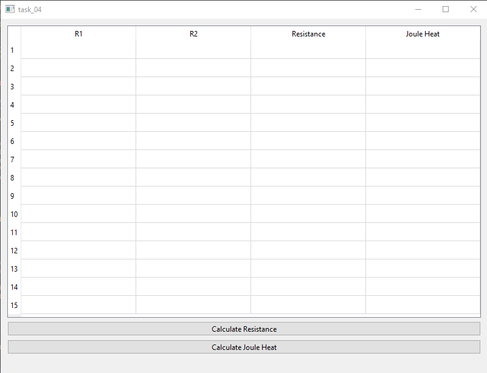
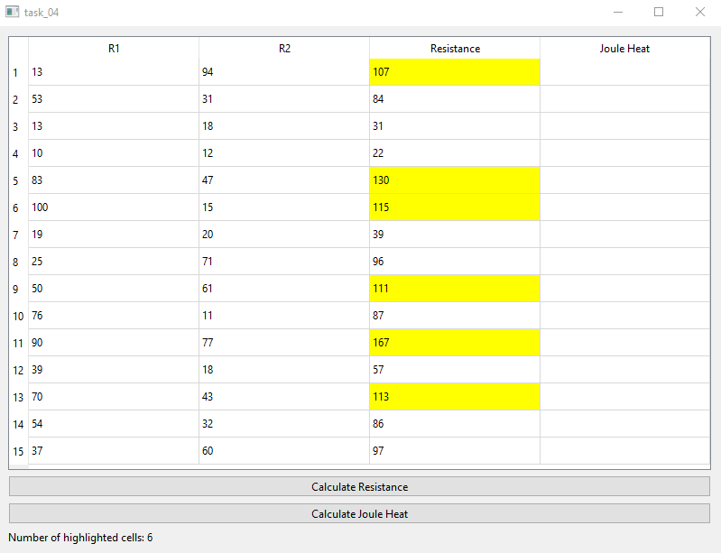
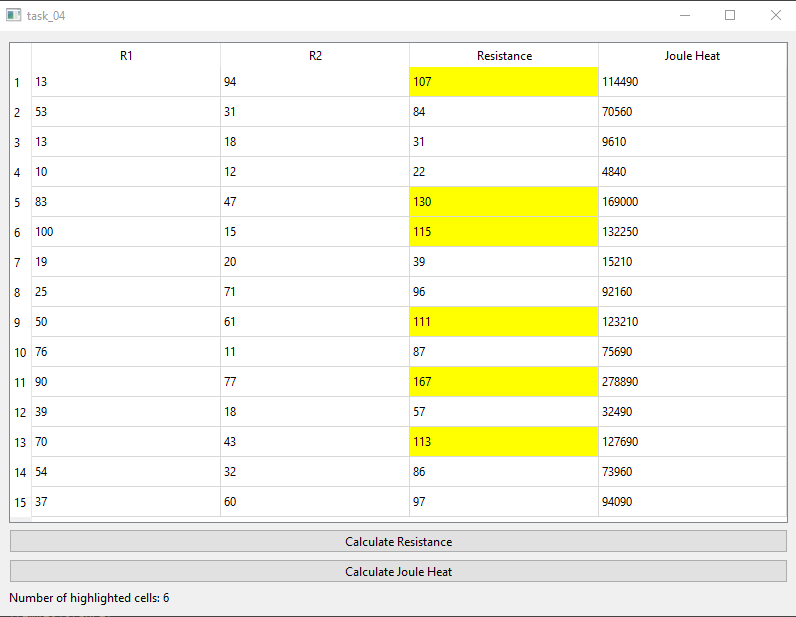

# Отчет по лабораторной работе №4

## Создание интерфейса простых приложений

## Вариант 10

## Реализация/ход работы

При запуске программы видим следующее.

При нажатии на кнопку расчёт сопротивления происходит перегенетрация таблицы:

При нажатии на кнопку расчёт Джоуля-Ленца:

