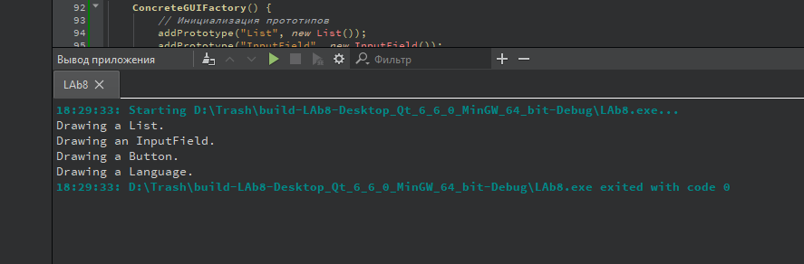

# Лабораторная работа №8

## Паттерны проектирования

## Вариант 22

## Цель лабораторной работы

Отработка умений и навыков применения паттернов проектирования.

## Задание №2

- Применить паттерн проектирования “Prototype” совместно с абстрактной фабрикой, то есть внести изменения в проект “Порождающие паттерны. Абстрактная фабрика”. То есть теперь в проекте абстрактная фабрика должна параметризоваться прототипами.

В итоге у нас:

