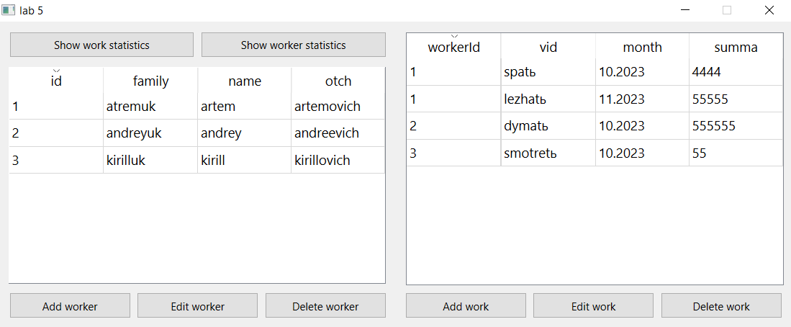
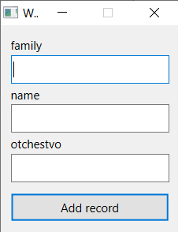
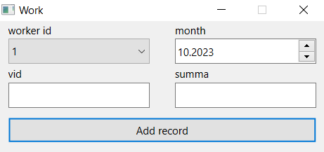
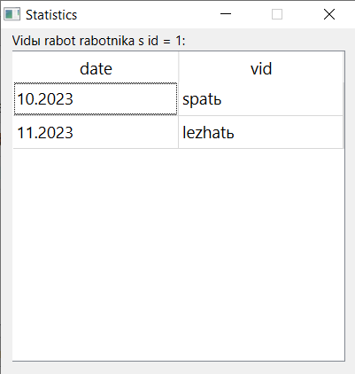
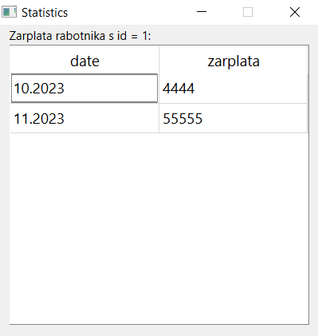

# Лабораторная работа №5

## Создание приложений баз данных

## Вариант 23

## Цель лабораторной работы

Отработка умений и навыков создания интерфейса баз данных.

## Задание

Напишите программу «Учет выплаты заработной платы».
В программе использовать две таблицы: fio (поля id, family, name, otch)
и vid (поля id, vid, month, summa). Создать запросы: вывод зар. платы за
месяц по каждому работнику; вывод вида работ работника за месяц.

## Ход работы

