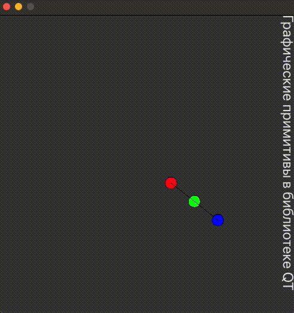

<<<<<<< HEAD
# Отчет по лабораторной работе №7

## Графические примитивы в библиотеке QT
=======
# Отчет по лабораторной работе №7 #

## Графические примитивы в библиотеке QT ##
>>>>>>> 99c6b996fda90efe0ab5f40c52d7cc48f9e69ad5
`Шубич Дарья Константиновна (ПО-9)`
## Цель работы ##

Изучить графические примитивы библиотеки QT.
<<<<<<< HEAD
## Вариант №10
=======
## Вариант №10 ##
>>>>>>> 99c6b996fda90efe0ab5f40c52d7cc48f9e69ad5

1. Вывести заданным шрифтом вертикально на экран наименование лабораторной
   работы – 2 балла.
2. Нарисовать цветную фигуру (2 балла) и организовать движение её по заданной траектории
   (6 баллов).

<<<<<<< HEAD
## Результат выполнения программы
=======
## Результат выполнения программы ##
>>>>>>> 99c6b996fda90efe0ab5f40c52d7cc48f9e69ad5

## Вывод работы ##

<<<<<<< HEAD
Изучила графические примитивы библиотеки QT.
=======
Изучила графические примитивы библиотеки QT.
>>>>>>> 99c6b996fda90efe0ab5f40c52d7cc48f9e69ad5
