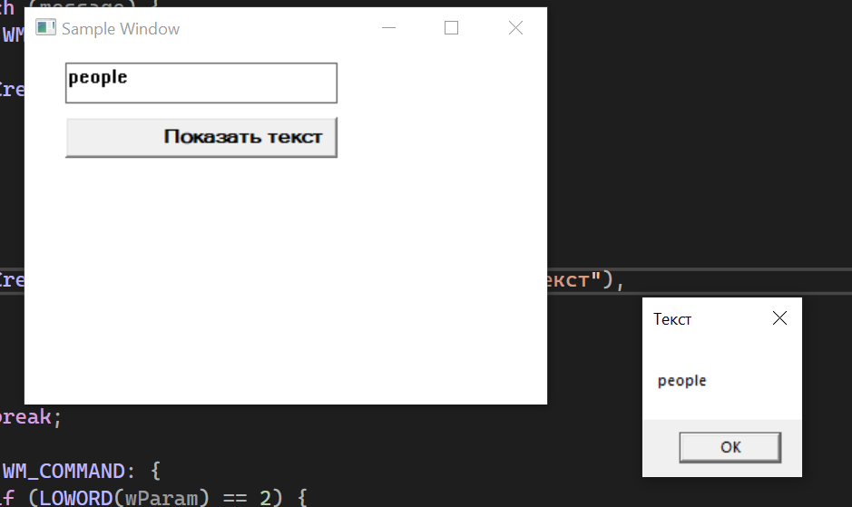

# Лабораторная работа №2 #

## Создание программы с графическим пользовательским интерфейсом в ОС Windows ##

## Вариант 1 ##

## Реализация/ход работы ##

### Цель работы: Научиться создавать простейшие приложения с графическим пользовательским интерфейсом в ОС Windows ###

#### **Условие** ####

_Создать приложение с кнопкой и полем для ввода текста. По нажатию на кнопку приложение должно создавать всплывающее окно с введённым текстом._

```c++

    // Создание поля для ввода текста
      CreateWindow(TEXT("edit"), NULL,
            WS_VISIBLE | WS_CHILD | WS_BORDER,
            30, 10,
            200, 30,
            hwnd, (HMENU)1, NULL, NULL);

  

    // Создание кнопки
    CreateWindow(TEXT("button"), TEXT("Показать текст"),
            WS_VISIBLE | WS_CHILD,
            30, 50,
            200, 30,
            hwnd, (HMENU)2, NULL, NULL);
        break;

        

    // Обработка нажатия кнопки
        if (LOWORD(wParam) == 2) {
            // Получение текста из поля ввода
            TCHAR text[100];
            GetDlgItemText(hwnd, 1, text, 100);
            // Вывод текста во всплывающем окне
            MessageBox(hwnd, text, TEXT("Текст"), MB_OK);
        }
     // Регистрация класса окна
    WNDCLASS wc = {};
    wc.lpfnWndProc = WndProc;
    wc.hInstance = hInstance;
    wc.lpszClassName = CLASS_NAME;
    RegisterClass(&wc);

    // Создание окна
    HWND hwnd = CreateWindowEx(
        0,                                      // Дополнительные стили окна
        CLASS_NAME,                             // Имя класса окна
        L"Sample Window",                      // Заголовок окна
        WS_OVERLAPPEDWINDOW,                    // Стили окна
        CW_USEDEFAULT, CW_USEDEFAULT,           // Позиция окна
        400, 300,                               // Размер окна
        nullptr, nullptr, hInstance, nullptr);

    // Основной цикл обработки сообщений
    MSG msg = {};
    while (GetMessage(&msg, nullptr, 0, 0)) {
        TranslateMessage(&msg);
        DispatchMessage(&msg);
    }
        
```

#### Результат работы программы ####



#### Вывод ####

Научились создавать простейшие приложения с графическим пользовательским интерфейсом в ОС Windows.
