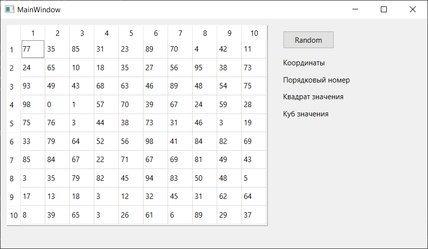
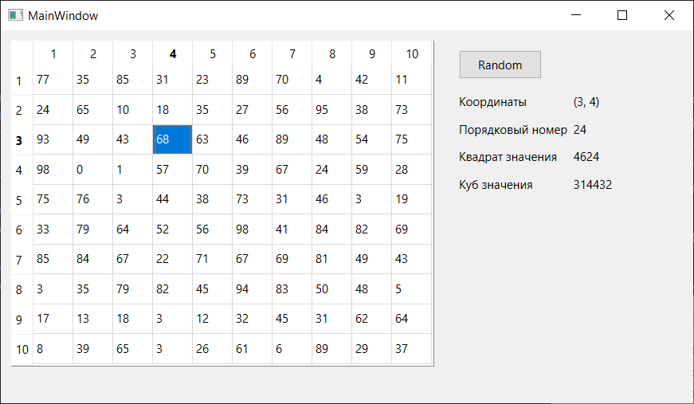
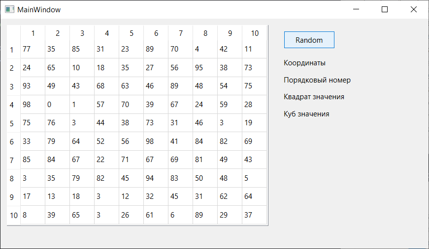

# Отчет по лабораторной работе №4

## Создание интерфейса простых приложений

## Вариант 21

## Реализация/ход работы

`Тупик Юлия леонтьевна (ПО-9)`

При запуске программы видим следующее.

При выборе элемента:

При нажатии на кнопку происходит перегенетрация таблицы и очистка вывода значений:

