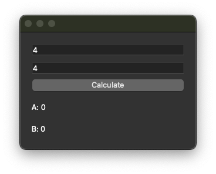
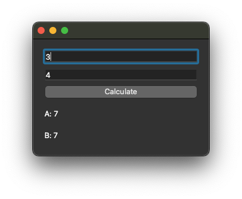
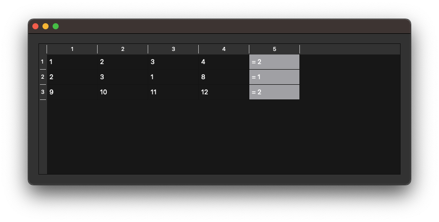
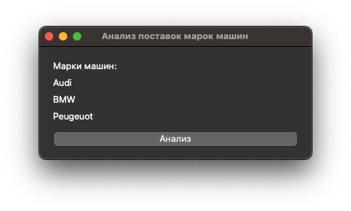
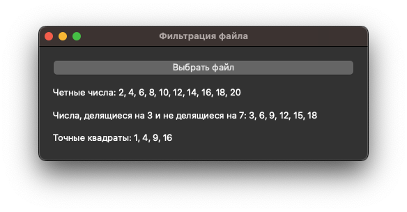

# Отчет по лабораторной работе №3

## Тема: «Контейнеры в Qt5»

## Вариант №4

`Тупик Юлия леонтьевна (ПО-9)`

## Ход работы

**Задание 1** Самостоятельное решение задач по вариантам. Реализовать приложения с консольным(графическим) интерфейсом пользователя.

Даны две переменные целого типа: A и B (переменные вводятся в **lineedit**). Если их значения не равны, то присвоить каждой переменной сумму этих значений, а если равны, то присвоить переменным нулевые значения.

**Задание 2** Самостоятельное решение задач по вариантам. Реализовать для одномерных массивов консольный вариант приложения, для двумерных – с (консольным)графическим интерфейсом. В консольном приложении значения элементов массива вводятся пользователем, в графическом – задаются произвольно.

1. Дан целочисленный массив размера N. Преобразовать его, прибавив к четным числам первый элемент. Первый и последний элементы массива не изменять.

2. Дана матрица размера m x n. В каждой строке найти количество элементов, больших среднего арифметического всех элементов этой строки.

**Задание 3** Самостоятельное решение задач по вариантам. Для работы со связным списком реализовать консольное приложение, со списком – использовать консольный(графический) интерфейс. Перебор элементов осуществлять с помощью итераторов.

1. Заполнить список случайными элементами и реализовать удаление элементов с позиций с N по K.

2. Заполнить связный список случайными элементами и отсортировать их по убыванию.

**Задание 4** Самостоятельное решение задач по вариантам. Реализовать приложения с консольным(графическим ) интерфейсом.

1. Сформировать стек из 8 чисел. Заменить значение первого элемента стека произведением первого и последнего, значение второго элемента стека − произведением второго и предпоследнего и т.д.

2. Заполнить очередь 8 случайными числами из интервала \[-20; 50]. Найти среднее арифметическое значений двух соседних элементов очереди. Результат поместить в очередь.

**Задание 5.** Самостоятельное решение задач по вариантам. Реализовать приложения с консольным (графическим) интерфейсом.

Известны марки машин, изготовляемых в данной стране и импортируемых за рубеж. Даны некоторые N стран. Определить для каждой из марок, какие из них были доставлены во все страны, доставлены в некоторые из стран, не доставлены ни в одну страну.

**Задание 6** Самостоятельное решение задач по вариантам. Реализовать приложения с консольным (графическим) интерфейсом.

Дан файл f, компоненты которого являются целыми числами. Получите в файле g все компоненты файла f:

а) являющиеся чётными числами;

б) делящиеся на 3 и не делящиеся на 7;

в) являющиеся точными квадратами.

